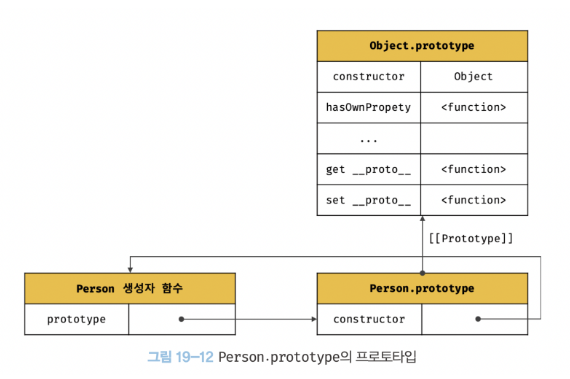

### 19.4 리터럴 표기법에 의해 생성된 객체의 생성자 함수와 프로토타입

---

명시적으로 new 연산자와 함께 생성자 함수를 호출하여 **인스턴스를 생성하지 않는 객체 생성방식**도 있다.

```cs
// 객체 리터럴
const obj = {};

// 함수 리터럴
const add = function(a, b) { return a + b };

// 배열 리터럴
const arr = [1, 2, 3];

// 정규 표현식 리터럴
const regexp = /is/ig;
```

리터럴 표기법에 의해 생성된 객체도 물론 프로토타입이 존재한다.
하지만 *리터럴 표기법에 의해 생성된 객체*의 경우 프로토타입의 constructor 프로퍼티가 가리키는 생성자 함수가
반드시 *객체를 생성한 생성자 함수*라고 단정할 수는 없다.

```cs
// obj 객체는 Object 생성자 함수로 생성한 객체가 아니라 객체 리터럴로 생성한다.
const obj = {};

// 하지만 obj 객체의 생성자 함수는 Object 생성자 함수다
console.log(obj.constructor === Object); // true
```

객체 리터럴에 의해 생성된 객체는 사실 Object 생성자 함수로 생성되는 것은 아닐까?
Object 생성자 함수는

- 생성자 함수에 인수를 전달하지 않거나, undefined / null을 인수로 전달하면서 호출하면
- 내부적으로는 추상 연산 `OrdinaryObjectCreate`를 호출하여 `Object.prototype`을 프로토타입으로 갖는 `빈 객체를 생성`한다.
- Object 생성자 함수 호출과 객체 리터럴의 평가는 `OrdinaryObjectCreate`를 호출해서 `빈 객체를 생성`한다는 점은 동일
  - 다만, new.target의 확인, 프로퍼티 추가하는 처리 등 세부처리에서 차이가 있다.
  - 따라서, 객체 리터럴에 의해 생성된 객체 != Object 생성자 함수가 생성한 객체

> 프로토타입과 생성자 함수는 언제나 쌍(pair)로 존재한다.

- 리터럴 표기법에 의해 생성된 객체의 생성자 함수와 프로토타입

| 리터럴표기법       | 생성자 함수 | 프로토타입         |
| ------------------ | ----------- | ------------------ |
| 객체 리터럴        | Object      | Object.prototype   |
| 함수 리터럴        | Function    | Function.prototype |
| 배열 리터럴        | Array       | Array.prototype    |
| 정규 표현식 리터럴 | RegExp      | RegExp.prototype   |

### 19.5 프로토타입의 생성 시점

---

> 프로토타입은 생성자 함수가 생성되는 시점에 더불어 생성된다.
> 객체가 생성되기 이전에 생성자 함수와 프로토타입은 이미 객체화되어 존재한다. 이후 생성자 함수 또는 리터럴 표기법으로 객체를 생성하면 프로토타입은 생성된 객체의 [[Prototype]] 내부 슬롯에 할당된다.

- 프로토타입과 생성자 함수는 단독으로 존재할 수 없고 언제나 쌍으로 존재한다.
- 생성자 함수는 `사용자 정의 생성자 함수`와 자바스크립트가 기본 제공하는 `빌트인 생성자 함수`로 구분할 수 있다.

#### 1. 사용자 정의 생성자 함수와 프로토타입 생성 시점

```cs
[ constructor와 non-constructor의 구분]
- 화살표 함수, ES6 메서드 축약 표현: 내부 메서드 [[Construct]]를 갖는 함수 객체
-> 일반 함수(함수 선언문, 함수 표현식)으로 정의한 함수 객체는 new 연산자와 함께 생성자 함수로서 호출할 수 있다.
```

- _생성자 함수로서 호출할 수 있는 함수_, 즉 `constructor`는 함수 정의가 `평가`되어 *함수 객체를 생성하는 시점*에 프로토타입도 더불어 생성된다.

```cs
// 함수 정의(constructor)가 평가되어 함수 객체를 생성하는 시점에 프로토타입도 더불어 생성된다.
// 함수 호이스팅 적용
console.log(Person.prototype); // {constructor: f}

// 생성자 함수
function Person(name) {
  this.name = name;
}
```

```cs
// 화살표 함수는 non-constructor다
const Person = name => {
  this.name = name;
};



// non-constructor는 프로토타입이 생성되지 않는다.
console.log(Person.prototype); // undefined
```

- 함수 선언문은 런타임 이전에 자바스크립트 엔진에 의해 먼저 실행된다.
- 함수 선언문으로 정의된 Person 생성자 함수는 어떤 코드보다 먼저 평가되어 함수 객체가 된다.
- 이때 프로토타입도 더불어 생성된다.
- 생성된 프로토타입은 Person 생성자 함수의 prototype 프로퍼티에 바인딩된다.

#### 2. 빌트인 생성자 함수와 프로토타입 생성 시점

Object, String, Number, Function, Array, RegExp, Date, Promise 등과 같은 빌트인 생성자 함수도
일반 함수와 마찬가지로 **빌트인 생성자 함수가 생성되는 시점에 프로토타입이 생성**된다.

모든 빌트인 생성자 함수는 **전역 객체가 생성되는 시점에 생성**된다.
생성된 프로토타입은 빌트인 생성자 함수의 prototype 프로퍼티에 바인딩 된다.

### 19.6 객체 생성방식과 프로토타입의 결정

---

객체의 생성방법

1. 객체 리터렁
2. Object 생성자 함수
3. 생성자 함수
4. Object.create 메서드
5. 클래스(ES6)

- 각 방식마다 세부적인 차이는 있으나 추상연산 OrdinaryObjectCreate에 의해 생성된다는 공통점.
- 즉, 추상연산 OrdinaryObjectCreate에 전달되는 인수에 의해 결정된다. 이 인수는 객체가 생성되는 시점에 객체 생성 방식에 의해 결정된다.
  - OrdinaryObjectCreate 호출로 빈 객체를 생성하고
  - 객체에 추가할 프로퍼티 목록이 인수로 전달될 경우 프로퍼티를 객체에 추가한다.
  - 인수로 전달받은 프로토타입을 자신이 생성한 객체의 [[Prototype]] 내부 슬롯에 할당한 다음, 생성한 객체를 반환한다.
