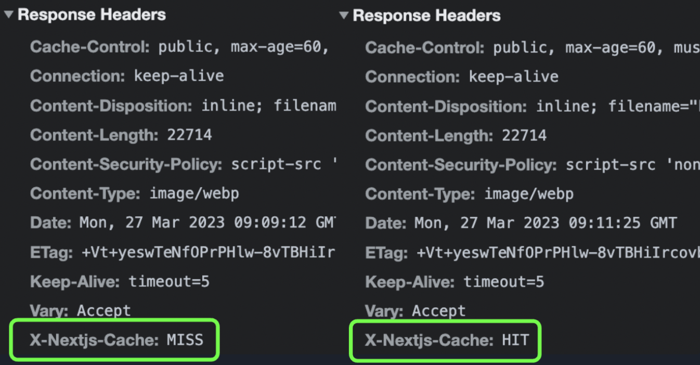

## Next/Image에서 제공하는 기능

- 장치의 크기에 맞춘 적절한 이미지 사이즈와 최신 이미지 포맷 지원
- Web Vitals의 CLS 발생을 방지: 이미지 로딩 중 레이아웃 시프트를 방지하여 사용자 경험을 개선
- 레이지 로드를 기본적으로 사용하고 있기 때문에, 뷰포트에 노출됐을 때 이미지 로드. 선택적으로 블러링 처리한 이미지를 먼저 노출하는 기능
- 이미지 리사이징. 외부 이미지도 리사이징 가능

## 어떻게 성능을 개선하는걸까?

- src에 선택한 이미지 경로가 아니라 `/_next/image?url=` 의 형식으로 이미지 경로를 전달한다.
- src가 변하는 이유는 Next/image 컴포넌트의 loader 속성에 의한 것

Next.js 서버는 동작시, `/_next/image`라는 이미지 최적화를 위한 라우트를 만들고, 내부에서 이미지 최적화 모듈을 사용하여 이미지 최적화를 한다. Next.js 서버의 이미지 최적화 요청 URL인 `_next/image`를 호출할 때 필요한 변환을 여기서 처리하고 있다. 그래서 기본 로더를 수정하지 않았다면 이미지 요청 주소를 변경하고 이미지 최적화를 처리하게 된다.

## 이미지 최적화 시점과 이미지 재사용

Next.js는 브라우저에서 실제로 유저가 이미지를 요청하면, dist 폴더 밑에 `cache/images` 폴더에 최적화한 이미지를 동적으로 만들고, 동일한 요청에 대해서는 이미 만들어 놓은 최적화한 이미지를 캐시로서 재사용한다.

Next.js의 서버가 동작한 뒤에 첫 요청이 들어온 경우는 이미지를 최적화하는 로직이 있기 때문에 시간이 조금 더 오래 걸린다. 첫 번째 요청이 끝난 후에 다시 동일한 이미지를 요청하는 경우에는 이미 최적화되어 있는 이미지를 재사용하기 때문에 좀 더 빠르게 응답하는 모습을 볼 수 있다.

## 최적화한 이미지를 재사용 했는지 여부

next.js에서 추가로 전달하는 응답 헤더를 살펴보면 알 수 있다.
이미지가 캐시되어 있지 않았다면 X-Nextjs-Cache 헤더에 `MISS`를,
이미지가 캐시되어 있었다면 `HIT`를 응답으로 전달하기 때문에
이 값을 보고 이미지의 캐시 여부에 대한 판단이 가능하다.

Reference.
https://oliveyoung.tech/blog/2023-06-09/nextjs-image-optimization/
