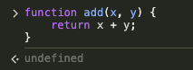
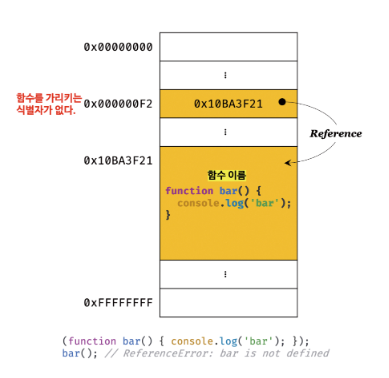
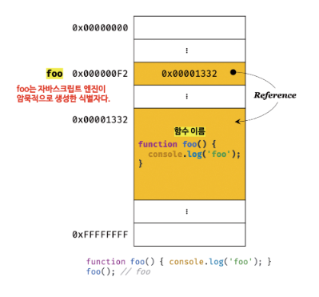

### 함수를 사용하는 이유

---

- `코드의 재사용`
  - 함수를 통해 중복을 제거한다
- `유지보수의 편의성 & 코드의 신뢰성`
- `코드의 가독성`
  - 함수는 객체타입의 값이다.
  - 따라서 이름(식별자)를 붙일 수 있다.
  - 적절한 함수 이름은 함수 내부 코드를 이해하지 않고도 함수의 역할을 파악할 수 있게 돕는다.

### 함수리터럴

---

함수 리터럴은 function 키워드, 함수 이름, 매개 변수 목록, 함수 몸체로 구성된다.

```cs
// 변수에 "함수 리터럴"을 할당
var f = function add(x,y) {
  return x + y;
}
```

```
💡 리터럴
문자 or 약속된 기호를 사용해 값을 생성하는 표기 방식
```

- 함수는 `일급객체`로서 일반객체와는 `호출이 가능하다`는 점에서 다르다.

### 함수 정의 방식

---

1. `함수 선언문`

```cs
function add(x,y) {
  return x + y;
}
```

2. `함수 표현식`

```cs
var add = function add(x,y) {
  return x + y;
};
```

3. `Function 생성자 함수`

```cs
var add = new Function('x', 'y', 'return x + y');
```

4. `화살표 함수(ES6)`

```cs
var add = (x, y) => x + y;
```

```cs
+ "변수" -> 선언(declaration)한다.
+ "함수" -> 정의(definition)한다.
```

### 코드의 문맥에 따른 자바스크립트 엔진의 함수 해석

> 자바스크립트 엔진은 `코드의 문맥` 에 따라 동일한 함수 리터럴을 함수 표현식 or 함수 선언문으로 해석하는 경우가 있다.

- 함수 선언문은 표현식이 아닌 문이므로 변수에 할당할 수 없다.
- 하지만 함수 선언문이 변수에 할당되는 것 처럼 보인다.
  

```cs
var add = function add(x, y) {
  return x + y;
};
```

이렇게 동작하는 이유는 자바스크립트 엔진이 `코드의 문맥`에 따라 `함수리터럴`을

- 표현식이 아닌 문인 `함수 선언문`으로 해석하는 경우
- 표현식인 문인 `함수 리터럴 표현식`으로 해석하는 경우가 있기 때문이다.

### 함수 선언문과 함수 리터럴 표현식

---

> 이 둘은 함수가 생성되는 것은 동일, 다만 호출에서 차이가 있다.

```cs
// 1️⃣ 함수 선언문으로 함수 호출 -> 호출 O
function foo() {
  console.log("foo"); // foo
}
foo();

// 2️⃣ 함수 리터럴 표현식으로 함수 호출 -> 호출 X
(function bar() {
  console.log("bar"); // ReferenceError: bar is not defined
});
bar();
```

#### 함수리터럴

```cs
+ 함수 이름은 함수 몸체 내에서만 참조할 수 있는 식별자다.
+ 함수 몸체 외부에서는 함수 이름으로 함수를 호출할 수 없다는 의미이다.
+ 즉, 함수를 가리키는 식별자가 없다는 것이다.
```



하지만 함수 선언문으로 정의된 함수는 foo라는 이름으로 호출할 수 있었다.
foo는 함수 몸체 내부에서만 유효한 식별자인 함수 이름이므로 호출할 수 없어야 한다.
-> **foo라는 이름으로 함수를 호출하려면** foo는 함수 이름이 아니라 `함수 객체를 가리키는 식별자`여야 한다.



자바스크립트 엔진은 생성된 함수를 호출하기 위해 **함수 이름과 동일한 이름의 식별자를 암묵적으로 생성하고**,
거기에 함수 객체를 할당한다.

```cs
// 의사코드(pseudo-code)로 표현하면 이렇다.
var add = function add(x, y) {
  return x + y;
}
```

- 함수는 함수 이름으로 호출하는 것이 아니라 함수 객체를 가리키는 식별자로 호출한다.
- 이 의사코드가 바로 `함수 표현식`이다.

### 함수 표현식

---

- 자바스크립트의 함수는 값처럼 `변수에 할당`할 수도 있고, `프로퍼티 값`이 될 수도 있으며 `배열의 요소`가 될 수도 있다.
- 이처럼 **값의 성질을 갖는 객체**를 `일급 객체`라 한다.

```cs
// 함수 표현식
var add = function (x, y) {
  return x + y;
};
```

- 함수 리터럴의 함수 이름은 생략할 수 있다. = `익명함수`
- 함수 표현식의 함수 리터럴을 익명함수로 사용하는 것이 일반적
- **함수를 호출할 때는 객체를 가리키는 식별자를 사용**해야 한다.

### 함수 생성 시점과 함수 호이스팅

---

```cs
// 함수 참조
console.dir(add); // f add(x, y)
console.dir(sub); // undefined

// 함수 호출
console.log(add(2, 5)); // 7
console.log(sub(2, 5)); // TypeError: sub is not a function

// 함수 선언문
function add(x, y) {
  return x + y;
}

// 함수 표현식
var sub = function(x, y) {
  return x + y;
}
```

- 함수 선언문으로 정의한 함수 = 함수 선언문 이전에 호출 O.
- 함수 표현식으로 정의한 함수 = 함수 표현식 이전에 호출 X.

=> **함수의 생성 시점이 다르다.**

### 함수 호이스팅

> 함수를 호출하기 전에 반드시 함수를 선언해야 한다는 당연한 규칙을 무시하므로
> `함수 표현식`을 사용할 것을 권장.

1. `함수 선언문`

```cs
+ 런타임 이전에 `함수 객체가 먼저 생성`된다.
+ 자바스크립트 엔진은 함수 이름과 동일한 이름의 `식별자를 암묵적으로 생성`하고, `생성된 함수 객체를 할당`한다.
+ 즉, 코드가 한줄씩 실행되는 런타임에는 이미 생성과 할당이 되어 있다 => 호출 가능
```

2. `함수 표현식`

```cs
+ 변수에 할당되는 값이 함수 리터럴인 문이다.
+ 변수 선언은 런타임 이전에 실행되어 undefined로 초기화 된다.
+ 변수 할당문의 값은 할당문이 실행되는 시점, 즉 런타임에 평가된다.
+ 따라서 함수 표현식으로 정의하면 함수 호이스팅이 아니라 변수 호이스팅이 발생한다 => 호출 불가
```

### Function 생성자 함수

자바스크립트가 기본 제공하는 빌트인 함수인 **Function 생성자 함수**에 매개변수 목록과 함수 몸체를 문자열로 전달하면서,
new 연산자와 함께 호출하면 **함수 객체를 생성해서 반환**한다.

```cs
💡 생성자 함수
+ 객체를 생성하는 함수를 말한다
```

```cs
var add = new Function('x', 'y', 'return x + y');
```

- Function 생성자 함수로 함수를 생성하는 방식은 일반적이지 않으며 바람직하지도 않다.
- Function 생성자 함수로 생성한 함수는 `클로저를 생성하지 않는` 등, 함수 선언문이나 함수 표현식으로 생성한 함수와 다르게 동작한다.

```cs
var add1 = (function () {
  var a = 10;
  return function (x, y) {
    return x + y + a;
  };
}());

console.log(add1(1, 2)); // 13

var add2 = (function () {
  var a = 10;
  return new Function('x', 'y', 'return x + y + a;');
}());

console.log(add1(1, 2)); // ReferenceError: a is not defined
```

### 화살표 함수

- ES6: function 키워드 대신 화살표(fat arrow =>)를 사용해 더 간략한 방법으로 선언
- 항상 익명함수로 정의한다
- 내부동작 또한 간략화되어 있다.
- 생성자 함수로 사용할 수 없으며, 기존 함수와 this 바인딩 방식이 다르고, prototype 프로퍼티가 없으며 arguments 객체를 생성하지 않는다.

```cs
// 화살표 함수
const add = (x, y) => x + y;
console.log(add(2, 5)); // 7
```

### 12.5 함수 호출

---

- 매개변수(parameter)는 함수 몸체 내부에서만 참조할 수 있다.
  - 즉, 매개변수의 스코프(유효 범위)는 함수 내부다.

```cs
function add(x, y) {
  return x + y;
}

console.log(x, y); // ReferenceError: x is not defined
// add 함수의 매개변수 x, y는 함수 몸체 내부에서만 참조할 수 있다.
```

- 함수는 매개변수와 인수의 개수가 일치하는지 체크하지 않는다. (에러가 나지 않음)
- 인수가 부족해서 할당되지 않는 매개 변수의 값은 Undefined다.

```cs
function add(x, y) {
  return x + y;
}

console.log(add(2)); // NaN
```

- 인수는 암묵적으로 arguments 객체의 프로퍼티로 보관된다.
- arguments 객체는 함수를 정의할 때 매개변수 개수를 확정할 수 없는 가변 인자 함수를 구현할 때 유용하게 사용된다

```cs
function add(x, y) {
  console.log(arguments);

  return x + y;
}

console.log(2, 5, 10);
```

### 인수 확인이 필요한 자바스크립트

```cs
1️⃣ 자바스크립트 함수는 매개변수와 인수의 개수가 일치하는지 확인하지 않는다.
2️⃣ 자바스크립트는 "동적 타입 언어"다. 따라서 자바스크립트 함수는 매개변수의 "타입을 사전에 지정할 수 없다."
```

따라서, 자바스크립트의 경우 함수를 정의할 때, 인수가 전달되었는지 확인할 필요가 있다.

```cs
1. typeof 연산자 를 사용하는 방법
2. 인수가 전달되지 않은 경우 단축 평가 를 사용하는 방법
3. 매개변수에 기본값(default value) 을 할당하는 방법
4. 정적 타입 선언 이 가능한 Typescript 사용하는 방법
```

```cs
// 1️⃣ typeof 연산자로 arguments 문제 방지
function add(x, y) {
  if (typeof x !== "number" || typeof y !== "number") {
    throw new TypeError("인수는 모두 숫자(number)값 이어야 합니다.");
  }

  return x + y;
}
console.log(add(1, 2)); // 3
console.log(add(2)); // TypeError: 인수는 모두 숫자(number)값 이어야 합니다.
console.log(add("a", "b")); // TypeError: 인수는 모두 숫자(number)값 이어야 합니다.

// 2️⃣ "단축 평가"로 arguments 문제 방지
function mul(a, b, c) {
  a = a || 1;
  b = b || 1;
  c = c || 1;

  return a * b * c;
}
console.log(mul(1, 2, 3)); // 6
console.log(mul(1, 2)); // 2
console.log(mul(1)); // 1
console.log(mul()); // 1

// 3️⃣ parameter default value 설정으로 argument 문제 방지 (ES6 도입)
// 인수를 전달하지 않았거나, undefined를 전달했을 경우해만 사용
function sub(a = 0, b = 0) {
  return a - b;
}
console.log(sub(10, 9)); // 1
console.log(sub(10)); // 10
console.log(sub()); // 0

```

### 값에 의한 호출 vs 참조에 의한 호출

---

- `값에 의한 호출(call by value)` : 함수 호출시 매개변수에 `원시 값(primitive value)`을 전달
- `참조에 의한 호출(call by reference)` : 함수 호출시 매개변수에 `객체(object)` 를 전달

#### 값에 의한 호출

- 원시 값은 `변경 불가능한 값(immutable value)` 성질
- 즉, 원시 타입의 argument 는 `값 자체가 복사되어 매개변수에 전달`
- 이 값을 변경(재할당을 통한 변경)해도 `원본은 훼손되지 않는다`. ( side effect X )

#### 참조에 의한 호출

- 객체는 `변경 가능한 값(mutable value)` 성질
- 즉, 객체 argument 는 `참조 값이 복사되어 매개변수에 전달`
- 참조 값을 통해 전달한 객체를 변경할 경우 `원본이 훼손된다`. ( side effect O )

```cs
[ 💩 참조에 의한 호출의 문제점 ]

= 객체가 변경될 수 있기 때문에 "상태 변화 추적"이 어렵다.

[ ✅ 문제 해결 방법 ]

- 객체를 불변 객체(immutable object)로 만들어 사용하는 것
- 상태 변경이 필요한 경우에는 객체의 방어적 복사(defensive copy)를 통해 원본 객체를 완전히 복제,
- 즉, 깊은 복사를 통해 새로운 객체를 생성하고 재할당을 통해 교체한다.

[ 💡 함수형 프로그래밍 ]

- 순수함수 = 외부 상태를 변경하지 않고, 외부상태에 의존하지도 않는 함수
순수 함수를 통해 side effect를 최대한 억제하여 오류를 피하고
프로그램의 안정성을 높이려는 프로그래밍 패러다임

```

```cs
function changeVal(primitive, obj) {
  primitive += 100;
  obj.name = "Lee";
}

// 외부 상태
var num = 100; // 원시 값
var person = { name: "Kim" }; // 객체

console.log(num); // 100
console.log(person); // { name: 'Kim' }

changeVal(num, person);

console.log(num); // 100
console.log(person); // { name: 'Lee' } 💩
```

### 다양한 함수의 형태

1. `즉시 실행 함수 (IIFE, Immediately Invoked Function Expression)`

함수 정의와 동시에 즉시 호출되는 함수.
단 한 번만 호출되며 다시 호출할 수 없다.

- 주로 익명함수를 사용한다.
- 기명함수도 가능은 하지만 호출은 불가함.
- 반드시 그룹 연산자 `(...)`로 감싸야 한다. 그렇지 않으면 에러 발생

```cs
// 익명함수
(function () {
  var a = 3;
  var b = 5;
  return a + b;
}());

//
```

2. `재귀 함수(recursive function)`

자기 자신을 호출하는 함수. 반복문(for, while)으로 사용 가능

- 탈출 조건을 반드시 만들어야 한다. (stack overflow)

```cs
function countdown(n) {
  if(n < 0) return;
  console.log(n);
  countdown(n - 1); // 재귀 호출
}

countdown(10);
```

3. `중첩 함수(nested function) == 내부 함수(inner function)`

중첩 함수는 외부 함수 내부에서만 호출할 수 있다.

- 중첩 함수는 자신을 포함하는 외부 함수를 돕는 헬퍼 함수(helper function) 역할을 한다.

```cs
function outer() {
  var x = 1;

  // 중첩 함수 == 내부 함수
  function inner() {
    var y = 2;

    // 외부 함수의 변수 참조
    console.log(x + y); // 3
  }

  inner();
}

outer();
```

4. `콜백 함수(callback function)`

함수의 매개변수(parameter)를 통해 다른 함수의 내부로 전달되는 함수

```cs
// 외부에서 전달받은 func 를 n 만큼 반복 호출 - 고차 함수 (HOF)
function repeat(n, f) {
  for (var i = 0; i < n; i++) {
    f(i);
  }
}

// 콜백 함수 정의 - logAll
var logAll = function (i) {
  console.log(i);
};

// 반복 호출할 함수를 인수로 전달
repeat(5, logAll); // 0 1 2 3 4
```

- 콜백 함수는 고차 함수에 의해 호출된다.
- 고차 함수는 필요에 따라 **콜백 함수에 인수(argument)를 전달**할 수 있다.
  - 그렇기 때문에 고차함수에 콜백함수 전달 시 **콜백 함수를 호출하지 않고 함수 자체를 전달**해야 함
- 함수는 `일급 객체` 이므로 **함수의 매개변수를 통해 함수를 전달 가능**
  - 함수는 더 이상 내부로직에 강력히 의존하지 않고 외부에서 로직의 일부분을 함수로 전달받아 수행하므로 유연한 구조를 갖는다
