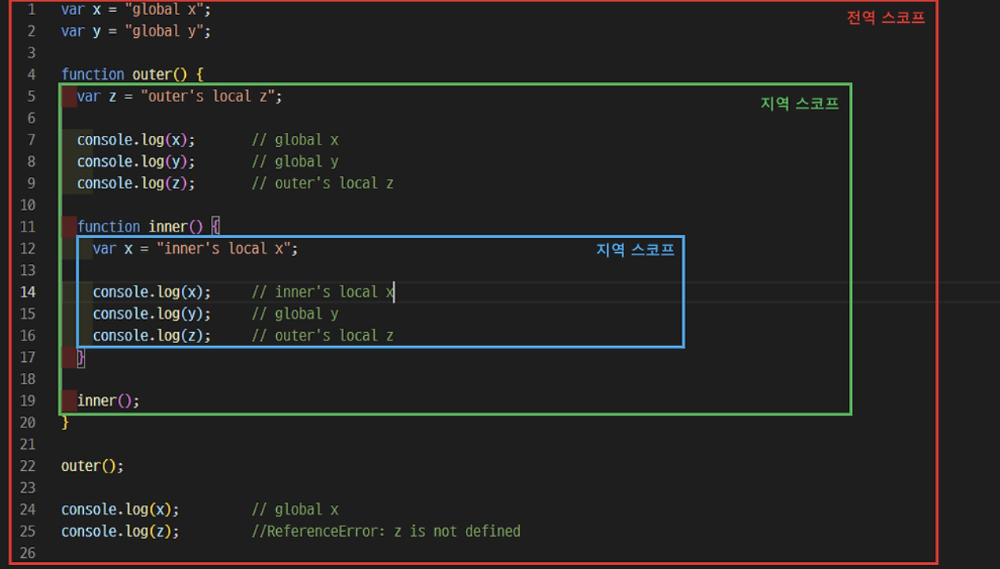
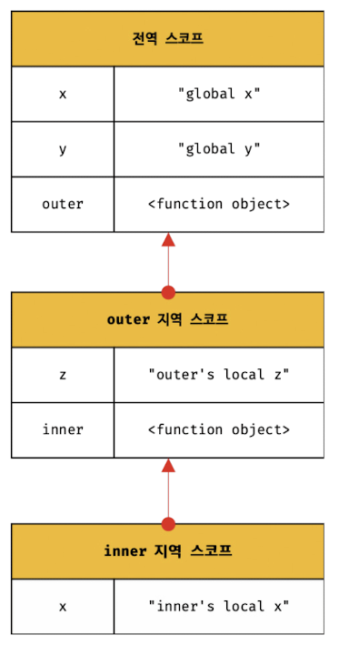

### 13.1 스코프란?

---

> 모든 식별자(변수 이름, 함수이름, 클래스 이름 등)는 `자신의 선언된 위치`에 의해
> 다른 코드가 식별자 자신을 참조할 수 있는 `유효범위(Scope)`가 결정된다.

- 자바스크립트의 스코트는 다른 언어의 스코프과 구별되는 특징이 있다.
- var 키워드로 선언한 변수와 let, const로 선언한 변수의 스코프도 다르게 동작한다.

```cs
var var1 = 1;

if(true) {
  var2 = 2;
  if(true) {
    var var3 = 3;
  }
}

function foo() {
  var var4 = 4;

  function bar() {
    var var5 = 5;
  }
}

console.log(var1); // 1
console.log(var2); // 2
console.log(var3); // 3
console.log(var4); // ReferenceError: var4 is not defined
console.log(var5); // ReferenceError: var5 is not defined
```

### 식별자 결정 (identifier resolution)

> 자바스크립트 엔진이 **이름이 같은 두 식별자** 중에 어떤 식별자를 참조해야 할 것인지를 결정하는 것

- 자바스크립트 엔진은 코드를 실행할 때 `코드의 문맥(context)`을 고려
- **코드가 어디서 실행**되며 **주변에 어떤 코드가 있는지**에 따라, 동일한 코드도 다른 결과를 만든다.
  - 이를 `렉시컬(lexical)환경`이라 하며, 코드의 문맥은 렉시컬 환경으로 이뤄진다.
  - 이를 구현한 것이 `실행컨텍스트(execution context)`이며, 모든 코드는 실행컨텍스트에서 평가되고 실행된다.

```cs
var x = "global";

function foo() {
  var x = "local";
  console.log(x); // local
}

foo();
console.log(x); // global

```

- 만약 Scope라는 개념이 없다면 같은 이름을 갖는 변수는 충돌을 일으키므로, 프로그램 전체에서 하나밖에 사용될 수 없다.
  - PC 디렉토리의 파일명은 다른 디렉토리와 중복되어도 상관 없는 거랑 같다.
  - 즉 Scope는 `Namespace`다.

```cs
[ 💡 var와 let, const 의 변수 중복 선언 차이 ]

1️⃣ var 로 선언된 변수는 같은 스코프 내에서 중복 선언이 허용된다.
이는 변수값이 재할당되어 변경되는 부작용을 발생시킨다.

function foo() {
  var x = 1;
  var x = 2; // 자바스크립트 엔진에 의해 var 키워드가 없는 것처럼 동작한다.
  console.log(x);
}
foo();

2️⃣ let, const로 선언된 변수는 같은 스코프 내에서 중복 선언을 허용하지 않는다.

function foo() {
  let x = 1;
  let x = 2; // SyntaxError: Identifier 'x' has already been declared
}
foo();
```

### 13.2 스코프의 종류

---

| 구분 | 설명                  | 스코프      | 변수      |
| ---- | --------------------- | ----------- | --------- |
| 전역 | 코드의 가장 바깥 영역 | 전역 스코프 | 전역 변수 |
| 지역 | 함수 몸체 내부        | 지역 스코프 | 지역 변수 |

- 전역 변수는 어디서든지 참조할 수 있다.
- 지역 변수는 자신의 지역 스코프와 하위 지역 스코프에서 유효하다

### 13.3 스코프 체인

---

- 함수 몸체 내부에서 정의한 함수 : `중첩 함수(nested function)`
- 중첩 함수를 포함하는 함수 : `외부 함수(outer function)`

> 스코프는 **함수의 중첩**에 의해 **계층적 구조**를 갖는다.
> 스코프가 **계층적으로 연결된 것**을 스코프 체인이라 한다.



변수를 참조할 때 자바스크립트 엔진은 **스코프 체인**을 통해 **변수를 참조하는 코드의 스코프에서 시작**하여 상위 스코프 방향으로 이동하며 **선언된 변수를 검색(indetifier resolution)**한다.



- 스코프 체인은 물리적인 실체로 존재한다.
- 자바스크립트 엔진은 코드(전역 코드와 함수 코드)를 실행하기에 앞서 위 그림과 유사한 자료구조인 **렉시컬 환경을 실제로 생성한다**
  - **변수 선언이 실행**되면 => 변수 식별자가 이 자료구조(렉시컬 환경)에 Key로 등록되고
  - **변수 할당**이 일어나면 => 자료구조의 변수 식별자에 해당하는 값을 변경한다.

```sc
[ 💡 렉시컬 환경 ]

스코프 체인은 실행 컨텍스트의 렉시컬 환경을 단방향으로 연결한 것이다.
전역 렉시컬 환경은 코드가 로드되면 곧바로 생성되고 함수의 렉시컬 환경은 함수가 호출되면 곧바로 생성된다.
```

### 스코프 체인에 의한 변수 검색

> 자바스크립트 엔진은 스코프 체인을 따라 변수를 참조하는 코드의 스코프에서 시작해서
> 상위 스코프의 방향으로 이동하며 선언된 변수를 검색한다.

- 변수를 참조하는 코드의 스코프에서 시작해서 `상위 스코프 방향으로 이동하며` 선언된 변수를 검색한다.

```cs
// 전역 함수
function foo() {
  console.log("global function foo");
}

function bar() {
  // 중첩 함수
  function foo() {
    console.log("local function foo");
  }

  foo(); // 1️⃣ local function foo
}

bar();
```

```cs
1️⃣ 함수 선언문으로 함수를 정의하면 **런타임 이전에 함수 객체가 먼저 생성**된다.
2️⃣ 자바스크립트 엔진은 **함수 이름과 동일한 이름의 식별자를 암묵적으로 선언**하고 생성된 함수 객체를 할당한다.

이처럼 함수도 식별자에 할당되기 때문에 스코프를 갖는다.
```

### 13.4 함수 레벨 스코프

---

- `블록 레벨 스코프(block level scope)`
  - 함수 몸체만이 아니라 모든 코드 블록(**if, for, while, try/catch** 등)이 지역 스코프를 만든다
- `함수 레벨 스코프(function level scope)`
  - 자바스크립트에서 **var 키워드로 선언된 변수** 는 오로지 **함수의 코드블록(함수 몸체)만을 지역 스코프로 인정**한다.
  - let, const는 블록 레벨 스코프를 지원한다.

```cs
[ 💡 var 키워드로 선언된 변수는 함수레벨 스코프만 인정한다. ]

var x = 1;

if (true) {
  // 함수 밖에서 var 키워드로 선언된 변수는 코드 블록 내에서 선언되었다 할지라도 모두 전역변수다.
  // 따라서 아래의 x는 전역변수이며, 이미 선언된 전역변수 x의 값을 재할당한다.
  var x = 10;
}

console.log(x); // 10
```

```cs
var i = 10;

// var 키워드로 선언된 변수는 블록레벨 스코프를 인정하지 않는다
// 따라서 for 문(블록레벨 스코프)에서 선언한 i는 전역 변수다
for(var i = 0; i < 5; i++) {
  console.log(i); // 0 1 2 3 4
}

// 의도치 않게 변수의 값이 변경되었다.
console.log(i); // 5
```

### 13.5 렉시컬 스코프 🔥

---

```cs
var x = 1;

function foo() {
  var x = 10;
  bar(); // 어디서 호출됐는지에 관계없이 함수 자신이 기억하고 있는 전역스코프를 상위 스코프로 사용한다.
}

function bar() { // 어디서 불리든 이 함수 위치 기준으로 상위스코프 설정!
  console.log(x);
}

foo();
bar();

// 1 1
```

- `동적 스코프(dynamic scope)`

  - 함수를 정의하는 시점에는 함수가 어디서 호출될지 알 수 없다.
  - **함수가 호출되는 시점**에 **동적으로 상위 스코프를 결정**해야 하기 때문에 동적 스코프라고 부른다.

- `렉시컬 스코프(lexical scope) = 정적 스코프(static scope)`
  - 상위 스코프가 동적으로 변하지 않고 **함수정의가 평가되는 시점**에 상위 스코프가 정적으로 결정
  - 대부분의 프로그래밍 언어는 렉시컬 스코프를 따른다.
  - **클로저**와 깊은 관계가 있다.
