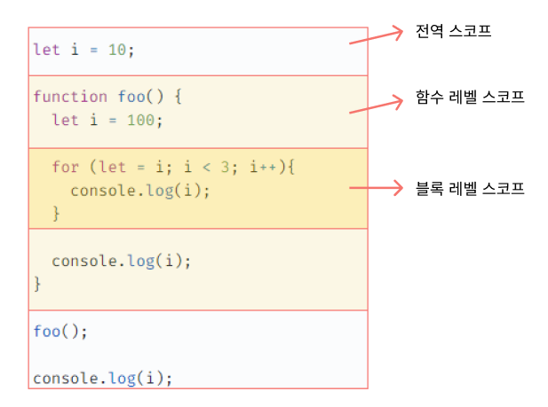
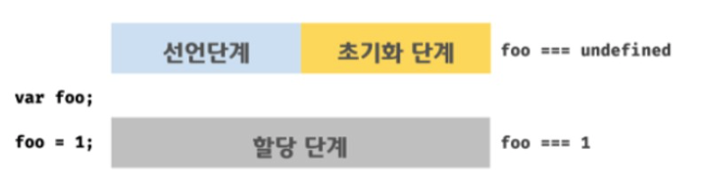
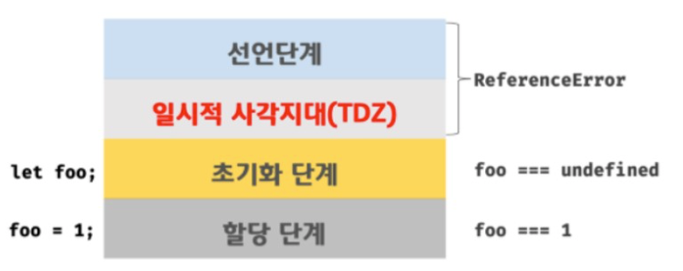

### 15.1 var 키워드로 선언한 변수의 문제점

---

#### 1. 변수 중복 선언 허용

```cs
var x = 1;
var y = 1;

// var 키워드로 선언된 변수는 같은 스코프 내에서 중복 선언을 허용한다.
// 초기화문이 있는 변수 선언문은 자바스크립트 엔진에 의해 var 키워드가 없는 것처럼 동작한다.
var x = 100;
// 초기화문이 없는 변수 선언문은 무시된다.
var y;

console.log(x); // 100
console.log(y); // 1
```

#### 2. 함수 레벨 스코프

- **함수 외부에서 var 키워드로 선언한 변수**는 코드 블록 내에서 선언해도 모두 `전역 변수`가 된다.
  - 함수레벨 스코프
- 함수레벨 스코프는 전역 변수를 남발할 가능성을 높이고, 의도치 않게 전역 변수가 중복 선언되는 경우가 발생한다.

```cs
var x = 1;

if (true) {
  // 코드 블록(블록 레벨), 하지만 var는 함수 레벨 스코프
  // 따라서, 블록 내 x 변수는 전역 변수처럼 스코프가 적용
  var x = 10;
}

console.log(x); // 10
```

#### 3. 변수 호이스팅

```cs
// 1️⃣ 선언 단계 - 이 시점에는 변수 호이스팅에 의해 이미 foo 변수가 선언되었다.
// 2️⃣ 초기화 단계 - 변수 foo는 undefined로 초기화된다.
console.log(foo); // undefined

// 3️⃣ 할당 단계 - 변수에 값을 할당
foo = 123;

console.log(foo); // 123

// 변수 선언은 런타임 이전에 자바스크립트 엔진에 의해 암묵적으로 실행된다.
var foo;
```

### 15.2 let 키워드

---

ES6에 도입되어 var 키워드의 단점을 보완하기 위해 등장했다.

#### 1. 변수 중복 선언 금지

- let 키워드로 이름이 같은 변수를 중복선언하면 `문법 에러(SyntaxError)`가 발생한다.

#### 2. 블록 레벨 스코프

- `var 키워드로 선언한 변수`는 `함수 레벨 스코프`를 따른다.
  - **함수의 코드 블록만을 지역 스코프로 인정**
- `let 키워드로 선언한 변수`는 `블록 레벨 스코프`를 따른다.
  - **모든 코드 블록(함수, if, for, while, try/catch)을 지역스코프로 인정**

```cs
let foo = 1; // 전역 변수

{
  let foo = 2; // 지역 변수
  let bar = 3; // 지역 변수
}

console.log(foo); // 1
console.log(bar); // ReferenceError: bar is not defined

// 같은 스코프의 블록 내에 있는 변수를 참조한다.
```



#### 3. 변수 호이스팅

var 로 선언한 변수와는 달리 let 으로 선언한 변수는 변수 호이스팅이 발생하지 않는 것처럼 동작한다.

```cs
console.log(foo); // ReferenceError: foo is not defined
let foo;
```

✅ **var로 선언한 변수**


- 런타임 이전에 자바스크립트 엔진에 의해 암묵적으로 '선언 단계'와 '초기화 단계'가 한번에 진행된다.
- 즉, `선언 단계`에서 스코프(실행 컨텍스트의 렉시컬 환경)에 변수 식별자를 등록해 자바스크립트 엔진에 변수의 존재를 알린다.
- 그리고 즉시 `초기화 단계`에서 undefined로 변수를 초기화한다.
- 따라서 변수 선언문 이전에 변수에 접근해도 스코프에 변수가 존재하기 때문에 에러가 발생하지 않는다.

✅ **let으로 선언한 변수**



- 선언 단계와 초기화 단계가 분리되어 진행된다

```cs
// 1️⃣ 런타임 이전에 선언 단계가 실행된다. 아직 변수가 초기화되지 않았다.
// ReferenceError: foo is not defined
// 💡 일시적 사각지대
console.log(foo);

let foo; // 2️⃣ 변수 선언문에서 초기화 단계가 실행된다.
console.log(foo); // undefined

foo = 1; // 3️⃣ 할당문에서 할당 단계가 실행된다
console.log(foo); // 1
```

#### 호이스팅 하지 않는 것 처럼 보이는 let

```cs
let foo = 1;
{
    console.log(foo); // 호이스팅이 발생하지 않으면 여기서 1을 리턴해야 한다.
    let foo = 2;
    // 하지만 호이스팅이 발생하기 때문에 참조에러가 발생함
    // Uncaught ReferenceError: Cannot access 'foo' before initialization
}
```

> 자바스크립트는 모든 선언 (var, let, const ,function, function\*, class..)를 호이스팅한다.
> 단, let, const, class를 사용한 선언문은 호이스팅이 발생하지 않는 것처럼 동작한다

#### 4. 전역 객체와 let

- var 키워드로 선언한 전역 변수와 전역 함수, 선언하지 않은 변수에 값을 할당한 암묵적 전역은 "전역 객체 window이 프로퍼티"가 된다.
- 전역 객체의 프로퍼티를 참조할 때 window를 생략 가능
- 단, 전역 객체는 "브라우저 환경 내에서 참조 가능"

```cs
// 이 예제는 브라우저 환경에서 실행해야 한다.

var x = 1; // 전역 변수
y = 2; // 암묵적 전역
function foo() {} // 전역 함수

// var 키워드로 선언한 전역 변수는 전역 객체 window의 프로퍼티다.
console.log(window.x); // 1
// 전역 객체 window의 프로퍼티는 전역 변수처럼 사용할 수 있다.
console.log(x); // 1

// 암묵적 전역은 전역 객체 window의 프로퍼티다.
console.log(window.y); // 2
console.log(y); // 2

// 함수 선언문으로 정의한 전역 함수는 전역 객체 window의 프로퍼티다.
console.log(window.foo) // f foo() {}
// 전역 객체 window의 프로퍼티는 전역 변수처럼 사용할 수 있다.
console.log(foo); // f foo() {}
```

- let,const 으로 선언한 전역 변수는 전역 객체의 프로퍼티가 아니다.
  - 즉, window 객체에 접근할 수 없다.
  - 이는 let 전역 변수는 보이지 않는 개념적인 블록 내 (전역 렉시컬 환경의 선언적 환경레코드(DER)에 존재하기 때문

### 15.3 const 키워드

---

> const 키워드 는 상수(constant) 를 선언하기 위해 사용 ( 단, 반드시 상수만을 위해 사용하는 것은 아님 )

- let과 비슷하며 다른 점은 아래와 같다.

#### 1. 선언과 초기화

const 키워드 변수는 반드시 선언과 동시에 초기화를 해야 한다.

```cs
const foo;  // SyntaxError: Missing initializer in const declaration
```

#### 2. 재할당 금지

const 키워드 변수는 재할당이 금지된다.

```cs
const foo = 1;
foo = 2; // TypeError: Assignment to constant variable.
```

#### 3. 상수

- const 키워드로 선언한 변수에 원시 값을 할당한 경우 변수 값을 변경할 수 없다.
- 원시 값은 변경 불가능한 값(immutable value)이므로 재할당 없이 값을 변경할 수 있는 방법이 없기 때문이다.
- 상수도 곧 변수이며, 즉 상수도 메모리 공간을 가지며 값을 가진다.
- 단, 변수는 언제든지 재할당을 통해 변수 값을 변경 가능하지만, 상수는 재할당이 금지될 뿐이다.
- 상수는 상태 유지와 가독성, 유지보수의 편의를 위해 적극적으로 사용을 권장
- 일반적으로 상수의 이름은 `대문자`로 선언 하며, 여러 단어로 이뤄진 경우 `언더 스코어(_)` 로 구분하며 `스네이크 케이스(snakeCase)` 로 표현한다.

```cs
// TAX_RATE 라는 상수(constant)를 적용하므로써, 코드의 가독성이 증가한다.
const TAX_RATE = 0.1;

let preTaxPrice = 100;
let afterTaxPrice = preTaxPrice + preTaxPrice * TAX_RATE;

console.log(afterTaxPrice); // 110
```

#### 4. const 키워드와 객체

- const 키워드 로 선언한 변수에 객체 를 할당한 경우는 변수 값을 변경할 수 있다.
- 객체는 재할당 없이도 직접 값을 변경이 가능하기 때문
- const 키워드 는 재할당을 금지할 뿐 불변 을 의미하지는 않는다

```cs
const person = {
  name: 'Lee';
};

// 객체는 변경 가능한 값이다. 따라서 재할당 없이 변경이 가능하다.
person.name = 'Kim';
console.log(person); // {name: 'Kim'}
```

### 15.4 var vs. let vs. const

---

- ES6를 사용한다면 var 키워드는 사용하지 않는다.
- 재할당이 필요한 경우에 한해 let 키워드를 사용한다. 이때 변수의 스코프는 최대한 좁게 만든다.
- 변경이 발생하지 않고 읽기 전용으로 사용하는(재할당이 필요없는 상수) 원시 값과 객체에는 const 키워드를 사용한다.
- const 키워드는 재할당을 금지하므로 var, let 키워드 보다 안전하다
