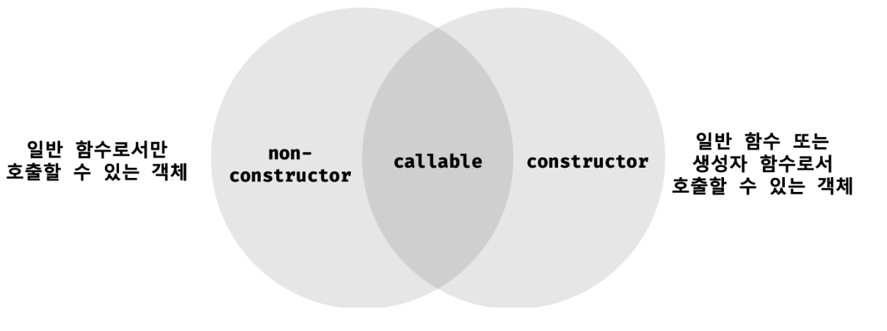

### 17.1 Object 생성자 함수

---

new 연산자와 함께 Object 생성자 함수를 호출하면 빈 객체를 생성하여 반환한다.
빈 객체를 생성한 이후 프로퍼티 또는 메서드를 추가하여 객체를 완성할 수 있다.

```cs
// 빈 객체의 생성
const person = new Object();

// 프로퍼티 추가
person.name = 'Lee';
person.sayHello = function() {
  console.log('Hi! My name is '+ this.name);
};

console.log(person); // {name: 'Lee', sayHello: f}
person.sayHello(); // Hi! My name is Lee
```

> 생성자 함수(constructor)란 new 연산자와 함께 호출하여 객체(인스턴스)를 생성하는 함수를 말한다.

- 인스턴스(instance): 생성자 함수에 의해 생성된 객체
- 자바스크립트는 Object 생성자 함수 이외에도 String, Number, Boolean, Function, Array, Date, RegExp, Promise 등의 빌트인(built-in) 생성자 함수를 제공한다.

```cs
// String 생성자 함수에 의한 String 객체 생성
const strObj = new String('Lee');
console.log(typeof strObj); // object
console.log(strObj);        // String ["Lee"]

const numObj = new Number(123);
const boolObj = new Boolean(true);
const func = new Function('x', 'return x + x');
const arr = new Array(1, 2, 3);
const regExp = new RegExp(/ab+c/i);
const date = new Date();
```

반드시 Object 생성자 함수를 사용해 빈 객체를 생성해야 하는 것은 아니다.
객체를 생성하는 방법은 **객체 리터럴을 사용하는 것이 더 간편**하다.

그러면 Object 생성자 함수는 왜 쓰는 걸까?

### 17.2 생성자 함수

---

### 17.2.1. 객체 리터럴에 의한 객체 생성 방식의 문제점

- 객체 리터럴에 의한 객체 생성방식은 직관적이고 간편하다.
- 하지만 객체 리터럴에 의한 객체 생성 방식은 **단 하나의 객체만 생성**한다.

> 💩 객체 리터럴로 표현하는 경우, 프로퍼티의 구조가 동일함에도 불구하고,
> 매번 같은 프로퍼티와 매서드를 기술해야 한다

```cs

const circle1 = {
  radius: 5,
  getDiameter() { // 매서드
    return 2 * this.radius;
  }
};

console.log(circle1.getDiameter()); // 10

const circle2 = {
  radius: 10,
  getDiameter() {
    return 2 * this.radius;
  }
};

console.log(circle2.getDiameter()); // 20
```

- `객체`는

  - `프로퍼티`를 통해 객체 고유의 `상태(status)`를 표현한다.
  - `메서드`를 통해 상태 데이터인 *프로퍼티를 참조*하고 조작하는 `동작(behavior)`을 표현한다.

- 상태(state)는 객체마다 각기 다른 값을 가질 수 있으나
- 메서드(behavior)의 경우는 내용이 동일한 경우가 일반적이다 -> `재활용성이 필요`

### 17.2.2. 생성자 함수에 의한 객체 생성 방식의 장점

> ✅ `객체(인스턴스)`를 생성하기 위한 `템플릿(클래스)`처럼 `생성자 함수를 사용`하여
> 프로퍼티 구조가 동일한 객체 여러개를 간편하게 생성할 수 있다.

```cs
// 생성자 함수
function Circle(radius) {
  // 생성자 함수 내부의 this는 생성자 함수가 생성할 인스턴스를 가리킨다.
  this.radius = radius;
  this.getDiameter = function () {
    return 2 * this.radius;
  }
}

// 인스턴스의 생성
const circle1 = new Circle(5); // 반지름이 5인 Circle 객체를 생성
const circle2 = new Circle(10); // 반지름이 10인 Circle 객체를 생성

console.log(circle1.getDiameter()); // 10
console.log(circle2.getDiameter()); // 20
```

#### 자바스크립트의 생성자 함수

- 생성자 함수는 `객체(인스턴스)를 생성`하는 함수다.
- 자바 같은 클래스 기반 객체 지향 언어와는 다르게 형식이 정해져 있지 않고
  - **일반 함수와 동일한 방법으로** 생성자 함수를 정의하고
  - **new 연산자**와 함께 호출하면
  - 해당 함수는 생성자 함수로 동작한다.

만약 new 연산자와 함께 생성자 함수를 호출하지 않으면 생성자 함수가 아니라 일반 함수로 동작한다.

```cs
// new 연산자와 함께 호출하지 않으면 생성자 함수로 동작하지 않는다.
// 즉, 일반 함수로서 호출된다.
const circle3 = Circle(15);

// 일반 함수로서 호출된 Circle은 반환문이 없으므로 암묵적으로 undefined를 반환한다.
console.log(circle3); // undefined

// 일반 함수로서 호출된 Circle 내의 this는 전역 객체를 가리킨다.
console.log(radius); // 15
```

### this

this는 객체 자신의 프로퍼티나 메서드를 참조하기 위한 `자기 참조 변수(self-referencing variable)`다. this가 가리키는 값, 즉 this 바인딩은 함수 호출 방식에 따라 동적으로 결정된다.

| 함수 호출방식        | this가 가리키는 값(this 바인딩)        |
| -------------------- | -------------------------------------- |
| 일반 함수로서 호출   | 전역 객체                              |
| 메서드로서 호출      | 메서드를 호출한 객체(마침표 앞의 객체) |
| 생성자 함수로서 호출 | 생성자 함수가 (미래에) 생성할 인스턴스 |

```cs
[ ✅ 함수는 다양한 방식으로 호출될 수 있다. ]
function foo() {
  console.log(this);
}

// 1️⃣ 일반적인 함수로서 호출
// 전역 객체는 브라우저 환경에서는 window, Node.js 환경에서는 global을 가리킨다.

foo(); // window

const obj = { foo }; // ES6 프로퍼티 축약 표현

// 2️⃣ 매서드로서 호출
obj.foo(); // obj

// 3️⃣ 생성자 함수로서 호출
const inst = new foo(); // inst
```

### 17.2.3. 생성자 함수의 인스턴스 생성과정

#### 생성자 함수의 역할

- **[`필수`]** 프로퍼티 구조가 동일한 인스턴스를 생성하기 위한 `템플릿(클래스)`로서 동작하여 인스턴스를 생성하는 것
- **[`옵션`]** 생성된 **인스턴스를 초기화**(`인스턴스 프로퍼티 추가 및 초기값 할당`)하는 것

this에 프로퍼티를 추가하고, 필요에 따라 전달된 인수를 프로퍼티의 초기값으로서 할당하여 인스턴스를 초기화 한다.

```cs
// 생성자 함수
function Circle(radius) {
  // 인스턴스 초기화
  this.radius = radius;
  this.getDiameter = function () {
    return 2 * this.radius;
  }
}

const circle1 = new Circle(5); // 반지름이 5인 Circle 객체를 생성
```

하지만 **인스턴스를 생성하고 반환하는 코드**는 보이지 않는다.

> new 연산자와 함께 생성자 함수를 호출하면 자바스크립트 엔진은 암묵적인 처리를 통해 인스턴스를 생성하고 반환한다.

#### 1. 인스턴스 생성과 this 바인딩

- 암묵적으로 빈 객체가 생성된다.
- 이 빈 객체가 `생성자 함수`가 생성한 `인스턴스`다.
- 이 빈 객체(인스턴스)는 `this에 바인딩` 된다.
  - binding: 식별자와 값을 연결하는 과정
  - this에 바인딩: this와 this가 가리킬 객체를 바인딩 하는 것

```cs
function Circle(radius) {
  // 1. 암묵적으로 인스턴스가 생성되고 this에 바인딩 된다.
  console.log(this); // Circle{}
  ...
}
```

#### 2. 인스턴스 초기화

- 생성자 함수에 기술되어 있는 코드가 한 줄씩 실행되어 **this에 바인딩되어 있는 인스턴스를 초기화** 한다.
- this에 바인딩되어 있는 인스턴스에 `프로퍼티나 메서드를 추가`하고 생성자 함수가 `인수로 전달받은 초기값을 인스턴스 프로퍼티에 할당`하여 초기화하거나 고정값을 할당한다.

```cs
// 생성자 함수 Person 선언
function Person(name) {
  // 1. 암묵적으로 빈 객체(인스턴스)가 생성되고 this에 바인딩

  // 2. this 에 바인딩되어 있는 인스턴스를 초기화
  this.name = name;
  this.getPersonName = function () {
    return `Hi, My Name is ${this.name}`;
  };
}

```

#### 3. 인스턴스 반환

- 생성자 함수 내부에서 모든 처리가 끝나면 완성된 인스턴스가 바인딩된 this를 암묵적으로 반환한다.

```cs
// 생성자 함수 Person 선언
function Person(name) {
  // 1. 암묵적으로 빈 객체(인스턴스)가 생성되고 this에 바인딩

  // 2. this 에 바인딩되어 있는 인스턴스를 초기화
  this.name = name;
  this.getPersonName = function () {
    return `Hi, My Name is ${this.name}`;
  };

  // 3. 완성된 인스턴스가 바인딩된 this(= 인스턴스)가 암묵적으로 반환된다.
  // 💩 명시적으로 원시값을 반환하면 원시값 반환은 무시되고 암묵적으로 this가 반환된다.
  return 100;
  // 💩 this가 아닌 다른 객체를 명시적으로 반환하면 this가 반환되지 못하고 return문에 명시한 객체가 반환된다
  return {}
}

// 인스턴스를 생성, Person 생성자 함수는 암묵적으로 this(Person 인스턴스)를 반환한다.
const person = new Person("Kim");
console.log(person);
// Person { name: 'Kim', getPersonName: [Function (anonymous)] }
```

> 결론적으로, 생성자 함수 내부에서 명시적으로 `this가 아닌 다른 값을 반환`하는 것은, 생성자 함수의 기본 동작을 훼손하는 것이므로, 반드시 `생성자 함수 내부에서는 return 문을 생략할 것`

### 17.2.4. 내부 메서드 [[Call]] 과 [[Construct]]

- 함수 선언문 또는 함수 표현식으로 정의한 함수는
  - 일반적인 함수로서 호출할 수 있는 것은 물론 생성자 함수로서 호출할 수 있다.
- 생성자 함수로서 호출한다는 것은 new 연산자와 함께 호출하여 객체를 생성하는 것을 의미한다
- 함수는 객체이므로 일반 객체와 동일하게 동작할 수 있다.
  - 일반 객체가 가지고 있는 내부 슬롯, 내부 메서드를 모두 가지고 있기 때문

```cs
// 함수는 객체다
function foo() {}

// 함수는 객체이므로 프로퍼티를 소유할 수 있다.
foo.prop = 10;

// 함수는 객체이므로 메서드를 소유할 수 있다.
foo.method = function () {
  console.log(this.prop);
};

foo.method(); // 10
```

- 일반 객체는 호출할 수 없지만 함수는 호출할 수 있다.
- 따라서 함수 객체는 일반 객체가 가지고 있는 내부 슬롯과 내부 메서드는 물론
  - 함수 객체만을 위한 [[Environment]], [[FormalParameters]] 등의 내부 슬롯과 [[Call]], [[Construct]] 같은 내부 메서드를 추가로 가지고 있다.

### [[Call]] 과 [[Construct]]

```cs
function foo() {}

// 일반적인 함수로서 호출: [[Call]]이 호출된다.
foo();

// 생성자 함수로서 호출: [[Construct]]가 호출된다
new foo();
```

- 내부 메서드 [[Call]] 을 갖는 함수 객체 → `callable`
- 내부 메서드 [[Construct]] 을 갖는 함수 객체 → `constructor`
  - 내부 메서드 [[Construct]] 을 갖지 않는 함수 객체 → `non-constructor`

### constructor 와 non-constructor

> 생성자 함수로 호출한다는 것 = `new 연산자`와 함께 호출하여 `객체를 생성`한다는 것

- `constructor` = 생성자 함수로 호출할 수 있는 형태 : `함수 선언문`, `함수 표현식`
- `non-constructor` = 생성자 함수로 호출할 수 없는 형태: `화살표 함수`, `매서드(ES6 메서드 축약 표현)`
  - non-constructor인 함수 객체를 생성자 함수로서 호출하면 에러가 발생한다.



```cs
// 일반 함수 정의: 함수 선언문, 함수 표현식
function foo() {}
const bar = function () {};
// 프로퍼티 x의 값으로 할당된 것은 일반 함수로 정의된 함수다. 이는 메서드로 인정하지 않는다.
const baz = {
  x: function () {}
};

// 일반 함수로 정의된 함수만이 constructor다.
new foo(); // -> foo {}
new bar(); // -> bar {}
new baz.x(); // -> x {}

// 화살표 함수 정의
const arrow = () => {};

new arrow(); // TypeError: arrow is not a constructor

// 메서드 정의: ES6의 메서드 축약 표현만 메서드로 인정한다.
const obj = {
  x() {}
};

new obj.x(); // TypeError: obj.x is not a constuctor
```

### new 연산자

> new 연산자와 함께 함수를 호출하면 해당 함수가 `생성자 함수`로 동작한다

- 즉, 함수 객체의 내부 메서드 중 `[[ Construct ]]` 가 호출된다는 것
- 단, 이 때 호출되는 함수는 `non-constructor` 가 아닌 `constructor` 여야한다는 것

```cs
// 생성자 함수 선언
function Person(name) {
  // ✅ PascalCase: 생성자 함수를 생성하여 일반함수와 구분한다!!!
  this.name = name;
  this.getPersonName = function () {
    return this.name;
  };
}

// 일반 함수가 new 연산자와 함께, 생성자 함수로 호출
const person = new Person("Kim");
console.log(person); // Person { name: 'Kim', getPersonName: [Function~]}
```

- 반대로 new 연산자 없이, 생성자 함수를 호출하면 일반 함수로 호출된다.
  - 즉, 함수 객체의 내부 메서드 [[Constuct]]가 호출되는 것이 아니라 [[Call]]이 호출된다.

```cs
// 생성자 함수가 new 연산자 없이, 일반 함수로 호출
const person = Person("WI");
console.log(person); // undefined << 🔍 반환 값이 없으므로 결과는 undefined
```

### new.target

> ES6에 도입되어, new 연산자와 함께 생성자 함수로서 호출되었는지 확인할 수 있는 문법

- `new 연산자`와 함께 `생성자 함수`로서 호출되면 함수 내부의 new.target은 **함수 자신을 가리킨다**.
- `new 연산자 없이` `일반 함수`로서 호출된 함수 내부의 new.target은 **undefined를 가리킨다**.

```cs
// 생성자 함수 Person 선언
function Person(name) {
  // Person 생성자 함수가 호출되면, 가장 먼저 new 연산자와 함께 호출된 것인지 확인
  if(!new.target) {
    // new 키워드와 함께 호출된 것이 아니면, 함수 내부에서 재귀로 new 연산자와 함께
    // Person 생성자 함수를 호출
    return new Person(name);
  }

  this.name = name;
  this.getPersonName = function () {
    return this.name;
  };
}

// new 연산자 없이 생성자 함수를 호출
const person = Person("Kim");

// 그럼에도 불구하고, Person 인스턴스가 정상적으로 생성되었고, 내부 매서드 호출됨
console.log(person.getPersonName()); // Kim
```

### 스코프 세이프 생성자 패턴(Scope-safe constructor)

> IE 같은 new.target 을 지원하지 않는 브라우저 환경에서, 생성자 함수를 보장하는 방법

```cs
function Person(name) {
  // Person 생성자 함수가 new 연산자와 함께 호출되지 않는 경우,
  // this는 전역 객체 window를 가리킨다
  // 즉 this는 Person과 프로포타입에 의해 연결되지 않는다.
  if(!(this instanceof Person)) {
    // new 연산자와 함께 호출된 Person 인스턴스를 반환하도록 재귀호출 한다.
    return new Person(name);
  }

  this.name = name;
  this.getPersonName = function() {
    return this.name;
  }
}

// new 연산자 없이 생성자 함수를 호출
const person = Person("Kim");

// 그럼에도 불구하고, Person 인스턴스가 정상적으로 생성되었고, 내부 매서드 호출됨
console.log(person.getPersonName()); // Kim
```

- new 연산자와 함께 생성자 함수에 의해 생성된 객체(인스턴스)는 프로토타입에 의해 생성자 함수와 연결된다.
- 이를 이용해 new 연산자와 함께 호출되었는지 확인할 수 있다.

- 대부분의 빌트인 생성자 함수(Object, String, Number, Boolean, Function, Array, Date, RegExp, Promise 등)는 new 연산자와 함께 호출되었는지를 확인한 후 적절한 값을 반환한다.

예를 들어, Object와 Function 생성자 함수는 new 연산자 없이 호출해도 new 연산자와 함께 호출했을 때와 동일하게 동작한다.

```cs
let obj = new Object(); // {}
obj = Object(); // {}

let f = new Function('x', 'return x ** x');
f = Function('x', 'return x ** x');
```

String, Number, Boolean 생성자 함수는 new 연산자와 함께 호출했을 때 String, Number, Boolean 객체를 생성하여 반환하지만 new 연산자 없이 호출하면 문자열, 숫자, 불리언 값을 반환한다.
이를 통해 데이터 타입을 변환하기도 한다.
