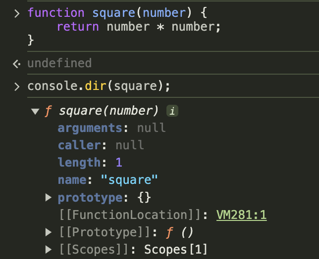

### 18.1 일급 객체

---

다음 조건을 만족하는 객체는 일급 객체 라고 한다.

- 무명의 *리터럴로 생성*할 수 있다. 즉, *런타임에 생성*이 가능하다.
- **변수나 자료구조(객체, 배열 등)에 저장**할 수 있다.
- **함수의 매개변수**에 전달할 수 있다.
- **함수의 반환값**으로 사용할 수 있다.

```cs
// 1. 함수는 무명의 리터럴로 생성할 수 있다.
// 2. 함수는 변수에 저장할 수 있다.
// 런타임(할당 단계)에 함수 리터럴이 평가되어 함수 객체가 생성되고 변수에 할당된다.
const increase = function (num) {
  return ++num;
};

const decrease = function (num) {
  return --num;
};

// 2. 함수는 객체에 저장할 수 있다.
const auxs = { increase, decrease };

// 3. 함수의 매개변수에 전달할 수 있다.
// 4. 함수의 반환값으로 사용할 수 있다.
function makeCounter(aux) {
  let num = 0;

  return function () {
    num = aux(num);
    return num;
  };
}

// 3. 함수는 매개변수에 함수를 전달할 수 있다.
const increase = makeCounter(auxs.increase);
console.log(increaser()); // 1
console.log(increaser()); // 2

const decreaser = makeCounter(predicate.decrease);
console.log(decreaser()); // -1
console.log(decreaser()); // -2
```

함수가 `일급 객체`라는 것은 `함수`를 `객체`와 동일하게 사용할 수 있다는 의미다.

- 객체는 값이므로 어디서든시 리터럴로 정의할 수 있으며, 런타임에 함수 객체로 평가된다.

#### 일급 객체로서 함수가 가지는 가장 큰 특징

- 일반 객체와 같이 **함수의 매개변수에 전달**할 수 있다.
- **함수의 반환값으로 사용**할 수 있다.
  - 이는 자바스크립트의 함수형 프로그래밍을 가능케하는 장점 중 하나이다.
- 함수는 객체이지만 일반 객체와는 차이가 있다.
  - 일반객체는 호출할 수 없지만 함수 객체는 호출할 수 있다.
  - 함수 객체는 일반객체에는 없는 함수 고유의 프로퍼티를 소유한다.

### 18.2 함수 객체의 프로퍼티

---

함수는 객체다. 따라서 함수도 프로퍼티를 가질 수 있다.
브라우저 콘솔에서 console.dir 메서드를 사용하여 함수 객체의 내부를 들여다 보자.



- square 함수의 모든 프로퍼티의 프로퍼티 어트리뷰트를 Object.getOwnPropertyDescriptors 메서드로 확인해보면 다음과 같다.

```cs
function square(number) {
  return number * number;
}

console.log(Object.getOwnPropertyDescriptors(square));

/*
{
    "length": {
        "value": 1,
        "writable": false,
        "enumerable": false,
        "configurable": true
    },
    "name": {
        "value": "square",
        "writable": false,
        "enumerable": false,
        "configurable": true
    },
    "arguments": {
        "value": null,
        "writable": false,
        "enumerable": false,
        "configurable": false
    },
    "caller": {
        "value": null,
        "writable": false,
        "enumerable": false,
        "configurable": false
    },
    "prototype": {
        "value": {},
        "writable": true,
        "enumerable": false,
        "configurable": false
    }
}
*/

// __proto__는 square 함수의 프로퍼티가 아니다.
console.log(Object.getOwnPropertyDescriptor(square, '__proto__')); // undefined

// __proto__는 Object.prototype 객체의 접근자 프로퍼티다.
// square 함수는 Object.prototype 객체로부터 __proto__ 접근자 프로퍼티를 상속받는다.

console.log(Object.getOwnPropertyDescriptor(Object.prototype, '__proto__'));
// {get: f, set: f, enumerable: false, configurable: true}
```

#### 18.2.1 arguments 프로퍼티

> arguments 객체는 함수 호출 시 전달된 `인수(arguments)`들의 정보를 담고 있는 **순회 가능한 유사 배열 객체**이며, **함수 내부에서 지역 변수처럼 사용**된다. 즉, 함수 외부에서는 참조할 수 없다.

자바스크립트는 함수의 매개변수와 인수의 개수가 일치하는지 확인하지 않는다. 따라서 함수 호출 시 매개변수 개수만큼 인수를 전달하지 않아도 에러가 발생하지 않는다.

```cs
function multiply(x, y) {
  console.log(arguments);
  return x + y;
}

console.log(multiply()); // NaN
console.log(multiply(1)); // NaN
console.log(multiply(1, 2)); // 2
console.log(multiply(1, 2, 3)); // 2,
// 초과된 인수는 암묵적으로 arguments 객체의 프로퍼티로 보관된다.
```

- arguments 객체: 인수를 프로퍼티 값으로 소유하며 프로퍼티 키는 인수의 순서를 나타낸다
  - callee 프로퍼티: arguments 객체를 생성한 함수, 즉 함수 자신을 가리킴
  - length 프로퍼티: 인수의 개수

```cs
[ 💡 arguments 객체의 Symbol(Symbol.iterator) 프로퍼티 ]
Symbol(Symbol.iterator) 프로퍼티는 arguments 객체를 순회 가능한 자료구조인 iterable을 만들기 위한 프로퍼티다. Symbol.iterator를 프로퍼티 키로 사용한 메서드를 구현하는 것에 의해 이터러블이 된다.

function multiply(x, y) {
  const iterator = arguments[Symbol.iterator]();

  // 이터레이터의 next 메서드를 호출하여 이터러블 객체 arguments를 순회
  console.log(iterator.next()); // {value: 1, done: false}
  console.log(iterator.next()); // {value: 2, done: false}
  console.log(iterator.next()); // {value: 3, done: false}
  console.log(iterator.next()); // {value: undfined, done: true}

  return x + y;
}
multiply(1, 2, 3);
```

- arguments 객체는 매개변수 개수를 확정할 수 없는 **가변 인자 함수**를 구현할 때 유용하다.

```cs
function sum() {
  let res = 0;

  // arguments 객체는 length 프로퍼티가 있는 유사 배열 객체이므로 for문으로 순회할 수 있다.
  for (let i = 0; i < arguments.length; i++) {
    res += arguments[i];
  }

  return res;
}

console.log(sum()); // 0
console.log(sum(1, 2)); // 3
console.log(sum(1, 2, 3)); // 6
```

- arguments 객체는 배열 형태로 인자 정보를 담고 있지만 실제 배열이 아닌 유사배열객체다.
- 유사배열객체란 length 프로퍼티를 가진 객체로 for문으로 순회할 수 있는 객체를 말한다.

```cs
ES6에서 도입된 이터레이션 프로토콜을 준수하면 순회 가능한 자료구조인 이터러블이 된다.
이터러블의 개념이 없었던 ES5에서 arguments 객체는 유사 배열 객체로 구분되었다.
하지만 이터러블이 도입된 ES6부터 arguments 객체는 유사 배열 객체이면서 동시에 이터러블이다.
```

유사 배열 객체는 배열이 아니므로 배열 메서드를 사용할 경우 에러가 발생한다.
따라서 배열 메서드를 사용하려면 `Function.prototype.call`, `Function.prototype.apply`를 사용해 간접 호출해야 하는 번거로움이 있다.

```cs
function sum() {
  // arguments 객체를 배열로 변환
  const array = Array.prototype.slice.call(arguments);
  return array.reduce(function (pre, cur) {
    return pre + cur;
  }, 0);
}

console.log(sum(1, 2)); // 3
console.log(sum(1, 2, 3, 4, 5)); // 15
```

이런 번거로움을 해결하기 위해 ES6에서는 Rest 파라미터를 도입했다.

```cs
function sum(...args) {
  return args.reduce((pre, cur) => pre + cur, 0);
}

console.log(sum(1, 2)); // 3
console.log(sum(1, 2, 3, 4, 5)); // 15
```

#### 18.2.2 caller 프로퍼티

- 함수 자신을 호출한 함수를 가리킨다

#### 18.2.3 length 프로퍼티

- 함수를 정의할 때 선언한 매개변수의 개수를 가리킨다.
- arguments 객체의 length 프로퍼티는 인자의 개수를 가리킨다. (구별할것)

#### 18.2.4 name 프로퍼티

- 함수 이름을 나타낸다.
- ES5, ES6에서 동작을 달리한다. 익명함수 표현식의 경우, ES5에서 name 프로퍼티는 빈 문자열을 값으로 갖는다. 하지만 ES6에서는 함수 객체를 가리키는 식별자를 값으로 갖는다.

```cs
// 기명 함수 표현식
var namedFunc = function foo() {};
console.log(namedFunc.name); // foo

// 익명 함수 표현식
var anonymousFunc = function() {};
// ES5: name 프로퍼티는 빈 문자열을 값으로 갖는다.
// ES6: name 프로퍼티는 함수 객체를 가리키는 변수 이름을 값으로 갖는다.
console.log(anonymousFunc.name); // anonymousFunc

// 함수 선언문(Function declaration)
function bar() {}
console.log(bar.name); // bar
```

#### 18.2.5 `__proto__` 접근자 프로퍼티

- 모든 객체는 [[Prototype]]이라는 내부 슬롯을 갖는다. [[Prototype]] 내부 슬롯은 객체 지향 프로그래밍의 상속을 구현하는 프로토타입 객체를 가리킨다.
- `__proto__` 프로퍼티는 [[Prototype]] 내부 슬롯이 가리키는 프로토타입 객체에 접근하기 위해 사용하는 접근자 프로퍼티다.

```cs
const obj = {a: 1};

// 객체 리터럴 방식으로 생성한 객체의 프로토타입 객체는 Object.prototype이다.
cosnole.log(obj.__proto__ === Object.prototype); // true

// 객체 리터럴 방식으로 생성한 객체는 프로토타입 객체인 Object.prototype의 프로퍼티를 상속받는다.
// hasOwnProperty 메서드는 OBject.prototype의 메서드다.
console.log(obj.hasOwnProperty('a')); // true
console.log(obj.hasOwnProperty('__proto__')); // false
```

```cs
[ hasOwnProperty ]
인수로 전달받은 프로퍼티 키가 객체 고유의 프로퍼티 키인 경우에만 true를 반환하고
상속받은 프로토타입의 프로퍼티 키인 경우 false를 반환한다.
```

#### 18.2.6 prototype 프로퍼티

- 함수가 객체를 생성하는 생성자 함수로 호출될 때 생성자 함수가 생성할 인스턴스의 프로토타입 객체를 가리킨다.
- 생성자 함수로 호출할 수 있는 함수 객체, 즉 constructor만이 소유하는 프로퍼티다.
- 일반 객체와 생성자 함수로 호출할 수 없는 non-constructor에는 prototype이 없다.

```cs
// 함수 객체는 prototype 프로퍼티를 소유한다.
(function () {}).hasOwnProperty('prototype'); // -> true

// 일반 객체는 prototype 프로퍼티를 소유하지 않는다.
({}).hasOwnProperty('prototype'); // -> false
```
