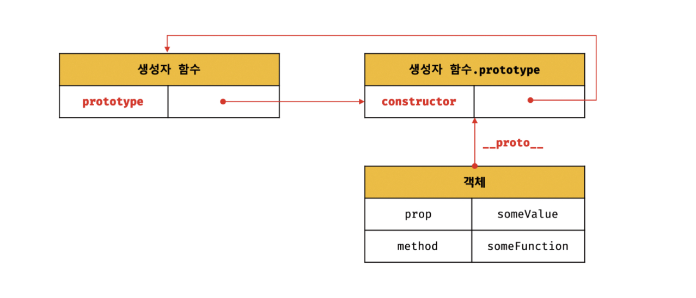
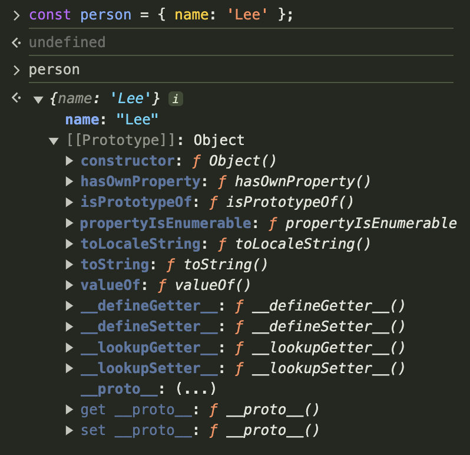
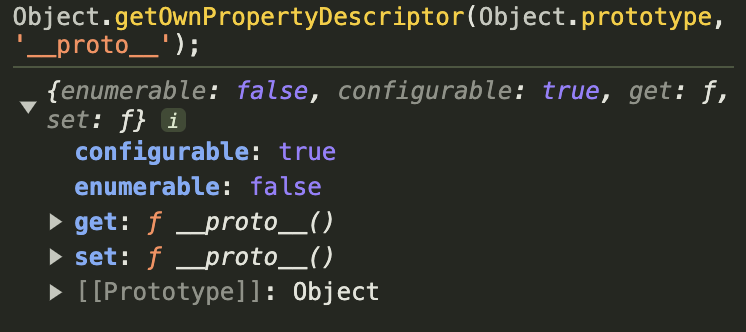
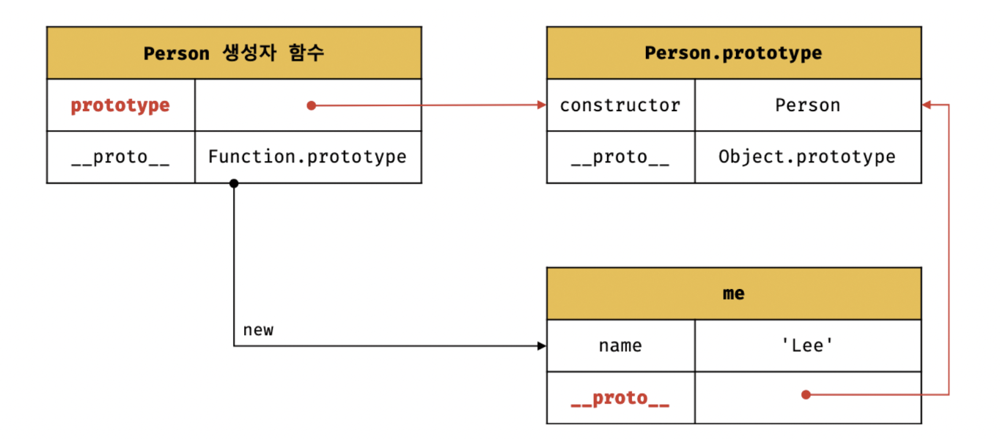

> 자바스크립트는 명령형, 함수형, 프로토타입 기반 객체지향 프로그래밍을 지원하는 멀티 패러다임 프로그래밍 언어다.

- 자바스크립트는 클래스 기반 객체지향 프로그래밍 언어보다 효율적이며 더 강력한 객체지향 프로그래밍 능력을 지니고 있는 프로토타입 기반의 객체지향 프로그래밍 언어다.

```cs
[ 📚 클래스 class ]

ES6에서 클래스가 도입되었다.
그렇다고 해서 기존의 프로토타입 기반 객체지향 모델을 폐지하고 새로운 객체지향 모델을 제공하는 것은 아니다.

클래스와 생성자 함수는 모두 프로토타입 기반의 인스턴스를 생성하지만 정확히 동일하게 동작하지는 않는다.
클래스는 생성자 함수보다 엄격하며 클래스는 생성자 함수에서는 제공하지 않는 기능도 제공한다.
```

자바스크립트는

- 객체 기반의 프로그래밍 언어이며
- 자바스크립트를 이루고 있는 거의 "모든 것"이 객체다.
- 원시타입(primitive type)의 값을 제외한 나머지 값들(함수, 배열, 정규 표현식 등)은 모두 객체다.

### 19.1 객체지향 프로그래밍

---

> 💡 객체지향 프로그래밍 :
> 프로그램을 명령어, 또는 함수의 목록으로 보는 전통적인 명령형(imperative) 프로그래밍의 절차지향적 관점에서 벗어나
> 여러개의 독립적 단위, 즉 `객체(object)의 집합`으로 프로그램을 표현하려는 프로그래밍 패러다임

- `객체 지향 프로그래밍`은 실세계의 실체(사물이나 개념)를 인식하는 철학적 사고를 프로그래밍에 접목하려는 시도에서 시작한다.
- 실체는 특징이나 성질을 나타내는 **속성(attribute/property)**을 가지고 있고, 이를 통해 실체를 인식하거나 구별할 수 있다.

  - 1. 사람은 이름, 주소, 성별, 나이, 등 다양한 속성을 갖는다.
  - 2. 이름이 아무개이고, 성별은 여성이며 나이는 20세인 사람과 같이 속성을 구체적으로 표현하면 특정한 사람을 다른 사람과 구별하여 인식할 수 있다.

- `추상화(abstraction)`: 다양한 속성 중에서 프로그램에 필요한 속성만 간추려내어 표현하는 것을 추상화라 한다.
- `객체`:
  - 속성을 통해 여러개의 값을 하나의 단위로 구성한 복합적인 자료구조
  - 객체의 상태를 나타내는 데이터와 상태 데이터를 조작할 수 있는 동작을 하나의 논리적인 단위로 묶어 생각한다.
- `객체지향 프로그래밍`:
  - 독립적인 객체의 집합으로 프로그램을 표현하려는 프로그래밍 패러다임
  - 객체의 상태를 나타내는 데이터와 상태 데이터를 조작할 수 있는 동작을 하나의 논리적인 단위로 묶어 생각

```cs
// 원 = 객체
// 반지름 , 원의 상태를 나타내는 데이터 = 속성 (Property)
// 반지름을 가지고 지름, 둘레, 넓이를 구할 수 있다. = 동작 (Method)

const circle = {
  radius: 5,
  getDiameter() {
    return 2 * this.radius;
  }
};
```

각 객체는 고유의 기능을 갖는 독립적인 부품으로 볼 수 있지만, **자신의 고유한 기능을 수행**하면서 **다른 객체와 관계성**을 가질 수 있다.
`다른 객체와 메시지를 주고받거나 데이터를 처리`할 수도 있다.
또는 다른 객체의 상태데이터나 동작을 `상속`받아 사용하기도 한다.

### 19.2 상속과 프로토타입

---

> 상속(inheritance)은 객체지향 프로그래밍의 핵심 개념, 어떤 객체의 프로퍼티 또는 메서드를 다른 객체가 상속받아 그대로 사용할 수 있는 것

- 자바스크립트는 프로토타입을 기반으로 `상속`을 구현하여 **불필요한 중복을 제거**한다.
- 불필요한 중복을 제거하는 방법은 **기존의 코드를 적극적으로 재사용** 하는 것이다.
- 코드 재사용은 개발 비용을 현저히 줄일 수 있는 잠재력이 있으므로 매우 중요하다.

```cs
[ 💩 인스턴스를 생성할 때마다 메서드가 중복생성 되는 로직 ]
function Circle(radius) { // 생성자 함수
  this.radius = radius;
  this.getArea = function() {
    // Math.PI는 원주율을 나타내는 상수다.
    return Math.PI * this.radius ** 2;
  };
}

const circle1 = new Circle(1);
const circle2 = new Circle(2);
```

이 로직은

- 인스턴스를 생성할 때마다
  - 매서드를 중복생성하고
  - 모든 인스턴스가 중복 소유한다.

이렇게 생성자 함수에 의해 생성된 모든 인스턴스가 동일한 매서드를 중복소유하는 것은 **메모리를 불필요하게 낭비**한다.
또한 인스턴스를 생성할 때마다 메서드를 생성하므로 퍼포먼스에도 악영향을 준다.

#### Prototype으로 상속을 구현하여 불필요한 중복을 제거해보자.

```cs
function Circle(radius) {
  this.radius = radius;
}

Circle.prototype.getArea = function() {
  return Math.PI = this.radius ** 2;
}

const circle1 = new Circle(1);
const circle2 = new Circle(2);
```

생성자함수는 프로토타입으로부터 메서드를 상속받아, 생성자 함수가 생성하는 모든 인스턴스는 하나의 메서드를 공유한다.

### 19.3 프로토타입 객체 (= 프로토타입)

---

> 프로토타입은 어떤 객체의 상위(부모) 객체 역할을 하는 객체로서, 다른 객체에 공유 프로퍼티(메서드 포함)을 제공한다.

프로토타입을 상속받은 하위(자식) 객체는 상위 객체의 프로퍼티를 자신의 프로퍼티처럼 자유롭게 사용할 수 있다.

- 모든 객체는 `[[Prototype]]`이라는 `내부슬롯`을 가지며, **이 내부 슬롯의 값은 프로토타입의 참조다**. (null인 경우도 있다.)
- [[Prototype]]에 저장되는 프로토타입은 `객체 생성 방식`에 의해 결정된다.
  - 즉, 객체가 생성될 때 객체 생성 방식에 따라 프로토타입이 결정되고 [[Prototype]]에 저장된다.

> 모든 객체는 `하나의 프로토타입`을 갖는다. 그리고 **모든 프로토타입은 생성자 함수와 연결**되어 있다.



[[Prototype]] 내부 슬롯에는 직접 접근할 수 없지만, 위 그림처럼 `__proto__` 접근자 프로퍼티를 통해
자신의 프로토타입, 즉 [[Prototype]] 내부 슬롯이 가리키는 프로토타입에 간접적으로 접근할 수 있다.
그리고 프로토타입은 자신의 `constructor 프로퍼티`를 통해 `생성자 함수`에 접근할 수 있고,
생성자 함수는 자신의 `prototype 프로퍼티`를 통해 프로토타입에 접근할 수 있다.

#### 19.3.1 `__proto__` 접근자 프로퍼티

> 모든 객체는 `__proto__` 접근자 프로퍼티를 통해 자신의 프로토타입, 즉 [[Prototype]] 내부 슬롯에 간접적으로 접근할 수 있다.



[[Prototype]]이 person 객체의 프로토타입인 `Object.prototype`이다.
이는 `__proto__` 접근자 프로퍼티를 통해 person 객체의 [[Prototype]] 내부 슬롯이 가리키는 객체인 Object.prototype에 접근한 결과를 크롬 브라우저가 콘솔에 표시한 것이다.
이처럼 모든 객체는 `__proto__` 접근자 프로퍼티를 통해 프로토타입을 가리키는 [[Prototype]] 내부 슬롯에 접근할 수 있다.

- 접근자 프로퍼티는 자체적으로는 값([[Value]] 프로퍼티 어트리뷰트)을 갖지 않고
- 다른 데이터 프로퍼티의 값을 읽거나 저장할 때 사용하는 접근자 함수, 즉 `[[Get]]`, `[[Set]]` 프로퍼티 어트리뷰트로 구성된 프로퍼티다.



```cs
Object.prototype의 접근자 프로퍼티인 __proto__는
getter/setter 함수라고 부르는 접근자 함수([[Get]], [[Set]] 프로퍼티 어트리뷰트에 할당된 함수)를 통해
[[Prototype]] 내부 슬롯의 값, 즉 프로토타입을 취득하거나 할당한다.
```

```cs
const obj = {};
const parent = {x:1};

// getter 함수인 get __proto__가 호출되어 obj 객체의 프로토타입을 취득
obj.__proto__;

// setter 함수인 set __proto__가 호출되어 obj 객체의 프로토타입을 교체
obj.__proto__ = parent;

console.log(obj.x); // 1
```

**`__proto__ `접근자 프로퍼티는 상속을 통해 사용된다**

`__proto__` 접근자 프로퍼티는 객체가 **직접 소유하는 프로퍼티가 아니라**, **Object.prototype의 프로퍼티다**.
모든 객체는 `상속`을 통해 `Object.prototype.__proto__` 접근자 프로퍼티를 사용할 수 있다.

```cs
const person = { name: 'Lee' };

// person 객체는 __proto__ 프로퍼티를 소유하지 않는다.
console.log(person.hasOwnProperty('__proto__')); // false

// __proto__ 프로퍼티는 모든 객체의 프로토타입 객체인 Object.prototype의 접근자 프로퍼티다.
console.log(Object.getOwnPropertyDescriptor(Object.prototype, '__proto__'));
// {get: f, set: f, enumerable: false, configurable: true}

// 모든 객체는 Object.prototype의 접근자 프로퍼티 __proto__를 상속받아 사용할 수 있다.
console.log({}.__proto__ === Object.prototype); // true
```

```cs
[ 💡 Object.prototype ]

모든 객체는 프로토입의 계층 구조인 프로토타입 체인에 묶여있다.

자바스크립트 엔진은 객체의 프로퍼티에 접근하려고 할 때, 해당 객체에 접근하려는 프로퍼티가 없다면
__proto__ 접근자 프로퍼티가 가리키는 참조를 따라
자신의 부모역할을 하는 프로토타입 프로퍼티를 순차적으로 검색한다.

프로토타입 체인의 종점, 즉 프로토타입 체인의 최상위 객체는 Object.prototype이며,
이 객체의 프로퍼티와 메서드는 모든 객체에 상속된다.
```

#### `__proto__` 접근자 프로퍼티를 통해 프로토타입에 접근하는 이유

[[Prototype]] 내부 슬롯의 값, 즉 프로토타입에 접근하기 위해 **접근자 프로퍼티를 사용하는 이유**는
상호 참조에 의해 프로토타입 체인이 생성되는 것을 방지하기 위해서다.

> 프로토타입 체인은 단방향 링크드 리스트로 구현되어야 한다.

- `순환참조(circular reference)`하는 프로토타입 체인이 만들어지면 프로퍼티를 검색할 때 무한 루프에 빠진다

```cs
// 💩 서로가 자신의 프로토타입이 되는 비정상적 프로토타입 체인 (순환참조(circular reference)
const parent = {};
const child = {};

// child의 프로토타입을 parent로 설정
child.__proto__ = parent;
// parent의 프로토타입을 child로 설정
parent.__proto__ = child; // TypeError: Cyclic __proto__ value
```

#### `__proto__` 를 코드 내에서 직접 사용하는 것은 권장하지 않는다.

- 모든 객체가 `__proto__` 를 사용할 수 있는 것은 아니다.
- `직접 상속`을 통해 `Object.prototype`을 상속받지 않는 객체를 생성할 수도 있기 때문에 `__proto__` 접근자 프로퍼티를 사용할 수 없는 경우가 있다.

```cs
// obj는 프로토타입 체인의 종점이다. 따라서 Object.__proto__를 상속받을 수 없다.
const obj = Object.create(null);
const parent = { x: 1 };

// 💩 obj는 Object.__proto__를 상속받을 수 없다.
console.log(obj.__proto__); // undefined

// ✅ 따라서 __proto__보다 Object.getPrototypeOf 메서드를 사용하는 편이 좋다.
console.log(Object.getPrototypeOf(obj)); // null

// ✅ obj 객체의 프로토타입을 교체
Object.setPrototypeOf(obj, parent); // obj.__proto__ = parent;
```

따라서 `__proto__` 접근자 프로퍼티 대신

- 프로토타입의 참조를 취득하고 싶은 경우에는 `Object.getPrototypeOf` 메서드를 사용,
- 프로토타입을 교체하고 싶은 경우에는 `Object.setPrototypeOf` 메서드를 사용할 것을 권장

#### 함수 객체의 prototype 프로퍼티

> 함수 객체만이 소유하는 prototype 프로퍼티는 생성자 함수가 생성할 인스턴스의 프로토타입을 가리킨다.

```cs
// 함수 객체는 prototype 프로퍼티를 소유한다.
(function () {}).hasOwnProperty('prototype'); // -> true

// 일반 객체는 prototype 프로퍼티를 소유하지 않는다.
({}).hasOwnProperty('prototype'); // -> false
```

prototype 프로퍼티는 **생성자 함수가 생성할 객체(인스턴스)의 프로토타입**을 가리킨다.
따라서 생성자 함수로서 호출할 수 없는 함수, 즉 **non-constructor인 화살표 함수**와 **ES6 메서드 축약 표현으로 정의한 메서드**는
prototype 프로퍼티를 소유하지 않으며 프로토타입도 생성하지 않는다.

```cs
// 화살표 함수 (non-constructor) -> prototype 프로퍼티 없음
const Person = name => {
  this.name = name;
};

console.log(Person.hasOwnProperty('prototype')); // false
console.log(Person.prototype); // undefined

// ES6의 메서드 축약표현 (non-constructor)
const obj = {
  foo() {}
};

console.log(obj.foo.hasOwnProperty('prototype')); // false
console.log(obj.foo.prototype); // undefined
```

생성자 함수로 호출하기 위해 정의하지 않은 일반 함수(함수 선언문, 함수 표현식)도 prototype 프로퍼티를 소유하지만
`객체를 생성하지 않는` 일반 함수의 prototype 프로퍼티는 아무런 의미가 없다.

모든 객체가 가지고 있는(엄밀히 말하면 `Object.prototype`으로부터 상속받은) `__proto__` 접근자 프로퍼티와 `함수 객체만이 가지고 있는 prototype 프로퍼티`는 결국 동일한 프로토타입을 가리킨다.

하지만 이들 프로퍼티를 사용하는 주체가 다르다.

| 구분                        | 소유       | 값                | 사용 주체   | 사용 목적                                                                    |
| --------------------------- | ---------- | ----------------- | ----------- | ---------------------------------------------------------------------------- |
| `__proto__` 접근자 프로퍼티 | 모든 객체  | 프로토타입의 참조 | 모든 객체   | 객체가 자신의 프로토타입에 접근, 교체하기 위해 사용                          |
| prototype 프로퍼티          | constuctor | 프로토타입의 참조 | 생성자 함수 | 생성자 함수가 자신이 생성할 객체(인스턴스)의 프로토타입을 할당하기 위해 사용 |

생성자 함수로 객체를 생성한 후 `__proto__` 접근자 프로퍼티와 prototype 프로퍼티로 프로토타입 객체에 접근해보자.

```cs
// 생성자 함수
function Person(name) {
  this.name = name;
}

const me = new Person('Lee');

// 결국 Person.prototype과 me.__proto__는 동일한 프로토타입을 가리킨다.
console.log(Person.prototype === me.__proto__); // true
```



#### 프로토타입의 constructor 프로퍼티와 생성자 함수

**모든 프로토타입은 constructor 프로퍼티를 갖는다.**
이 **constructor 프로퍼티**는 prototype 프로퍼티로 **자신을 참조하고 있는 생성자 함수**를 가리킨다.

이 연결은 **생성자 함수가 생성**될 때, 즉 **함수 객체가 생성될 때** 이뤄진다.

```cs
// 생성자 함수
function Person(name) {
  this.name = name;
}

const me = new Person('Lee');

// me 객체의 생성자 함수는 Person이다.
console.log(me.constructor === Person); // true
```

Person 생성자 함수는 me 객체를 생성했다.
이때 me 객체는 프로토타입의 constructor 프로퍼티를 통해 생성자 함수와 연결된다.
me 객체에는 constructor 프로퍼티가 없지만, me 객체의 프로토타입인 Person.prototype에는 constructor 프로퍼티가 있다.

따라서 me 객체는 프로토타입인 Person.prototype의 constructor 프로퍼티를 상속받아 사용할 수 있다.
