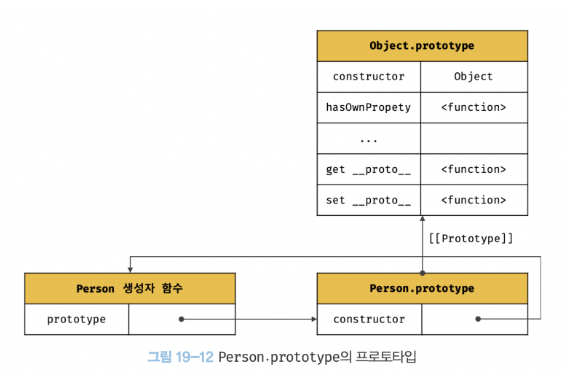
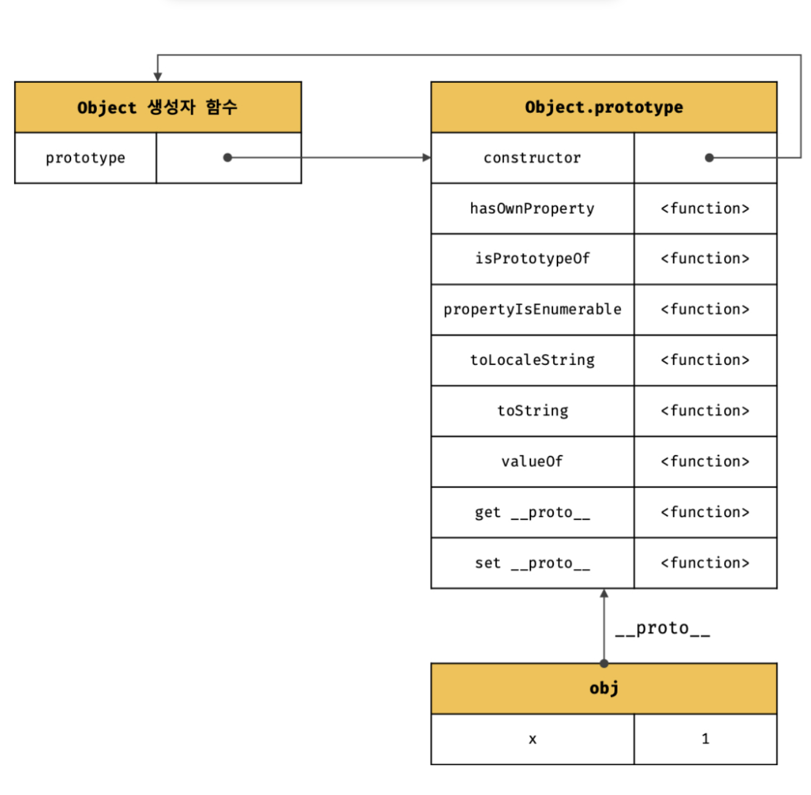
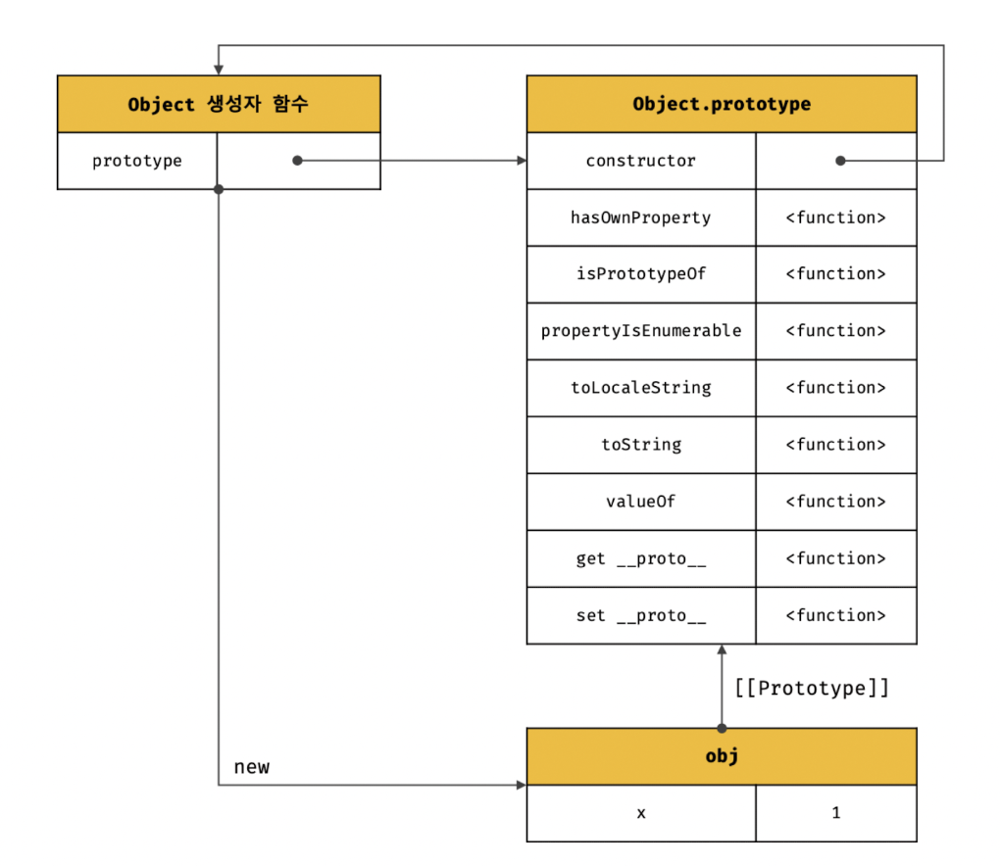
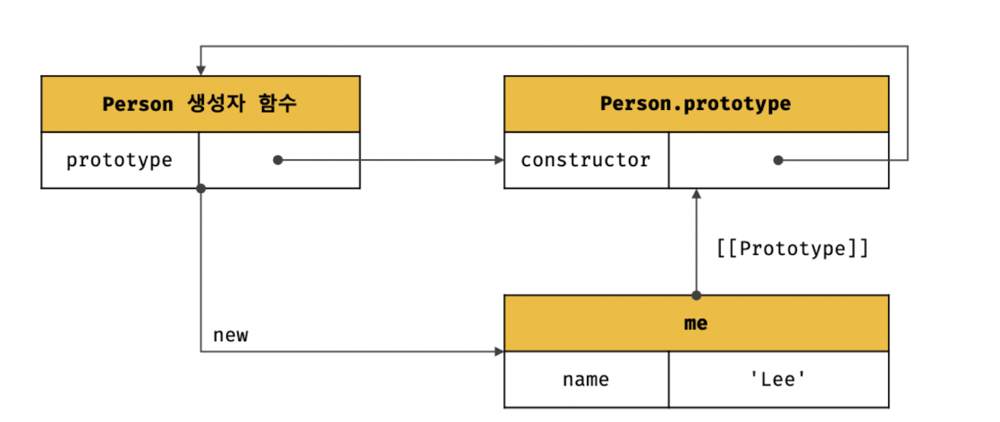
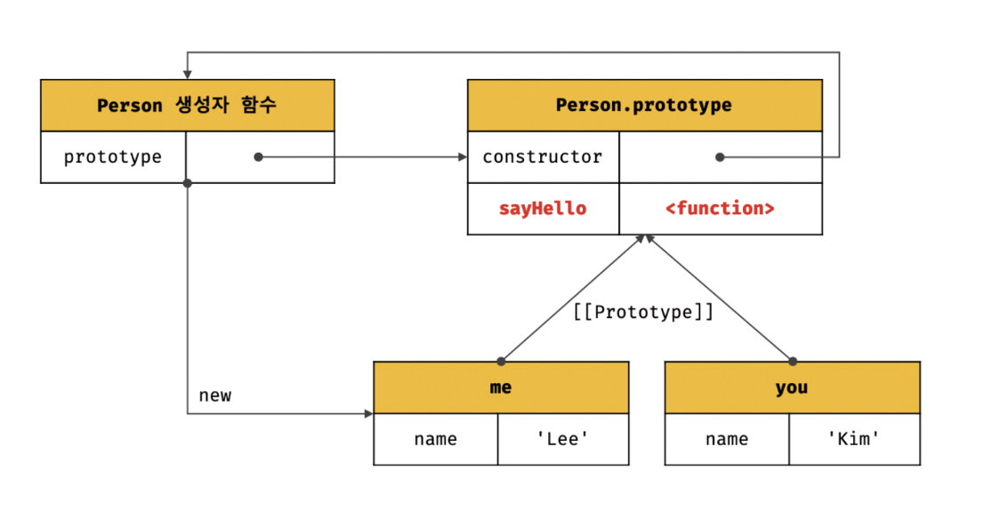
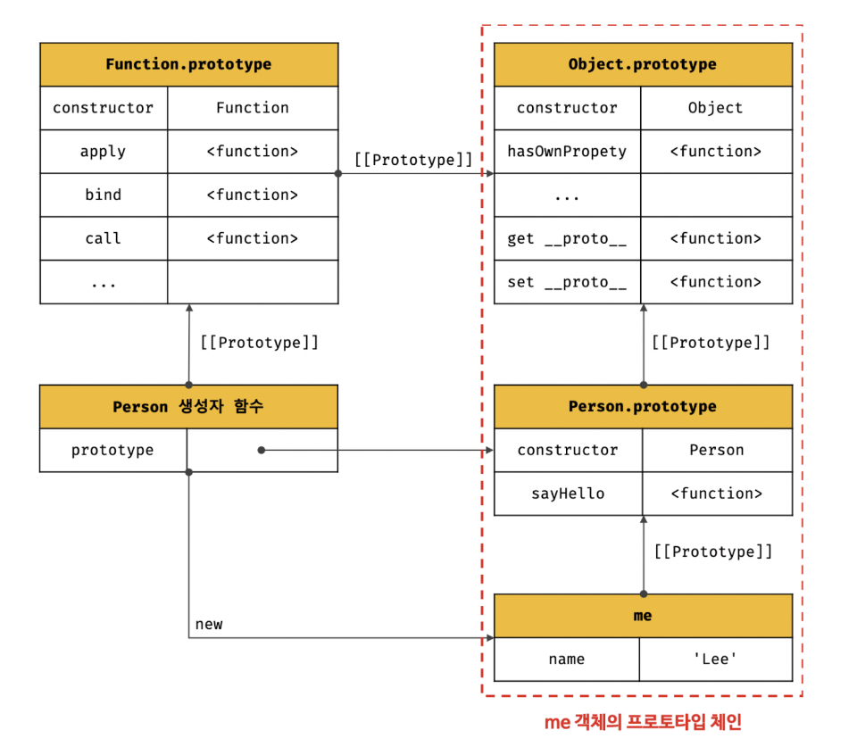
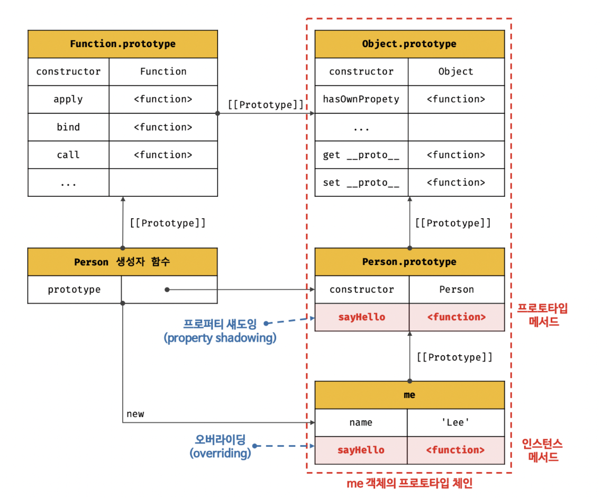
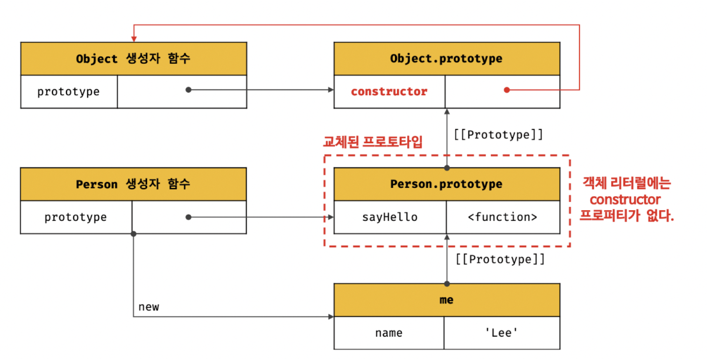
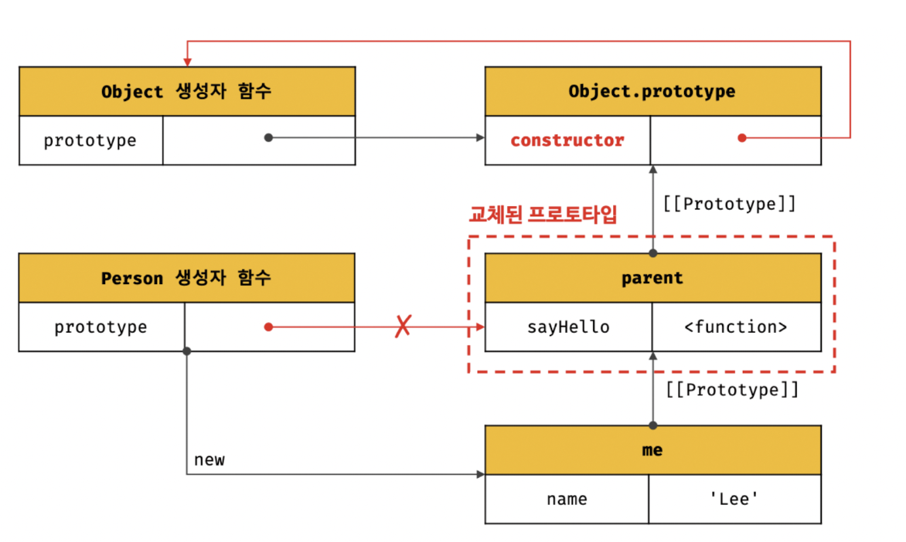
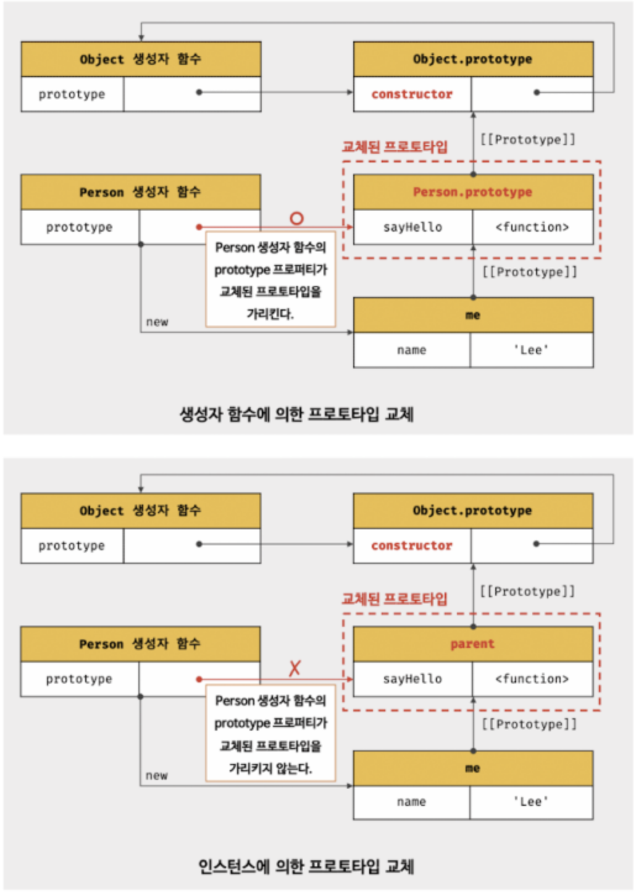

### 19.4 리터럴 표기법에 의해 생성된 객체의 생성자 함수와 프로토타입

---

명시적으로 new 연산자와 함께 생성자 함수를 호출하여 **인스턴스를 생성하지 않는 객체 생성방식**도 있다.

```cs
// 객체 리터럴
const obj = {};

// 함수 리터럴
const add = function(a, b) { return a + b };

// 배열 리터럴
const arr = [1, 2, 3];

// 정규 표현식 리터럴
const regexp = /is/ig;
```

리터럴 표기법에 의해 생성된 객체도 물론 프로토타입이 존재한다.
하지만 *리터럴 표기법에 의해 생성된 객체*의 경우 프로토타입의 constructor 프로퍼티가 가리키는 생성자 함수가
반드시 *객체를 생성한 생성자 함수*라고 단정할 수는 없다.

```cs
// obj 객체는 Object 생성자 함수로 생성한 객체가 아니라 객체 리터럴로 생성한다.
const obj = {};

// 하지만 obj 객체의 생성자 함수는 Object 생성자 함수다
console.log(obj.constructor === Object); // true
```

객체 리터럴에 의해 생성된 객체는 사실 Object 생성자 함수로 생성되는 것은 아닐까?
Object 생성자 함수는

- 생성자 함수에 인수를 전달하지 않거나, undefined / null을 인수로 전달하면서 호출하면
- 내부적으로는 추상 연산 `OrdinaryObjectCreate`를 호출하여 `Object.prototype`을 프로토타입으로 갖는 `빈 객체를 생성`한다.
- Object 생성자 함수 호출과 객체 리터럴의 평가는 `OrdinaryObjectCreate`를 호출해서 `빈 객체를 생성`한다는 점은 동일
  - 다만, new.target의 확인, 프로퍼티 추가하는 처리 등 세부처리에서 차이가 있다.
  - 따라서, 객체 리터럴에 의해 생성된 객체 != Object 생성자 함수가 생성한 객체

> 프로토타입과 생성자 함수는 언제나 쌍(pair)로 존재한다.

- 리터럴 표기법에 의해 생성된 객체의 생성자 함수와 프로토타입

| 리터럴표기법       | 생성자 함수 | 프로토타입         |
| ------------------ | ----------- | ------------------ |
| 객체 리터럴        | Object      | Object.prototype   |
| 함수 리터럴        | Function    | Function.prototype |
| 배열 리터럴        | Array       | Array.prototype    |
| 정규 표현식 리터럴 | RegExp      | RegExp.prototype   |

### 19.5 프로토타입의 생성 시점

---

> 프로토타입은 생성자 함수가 생성되는 시점에 더불어 생성된다.
> 객체가 생성되기 이전에 생성자 함수와 프로토타입은 이미 객체화되어 존재한다. 이후 생성자 함수 또는 리터럴 표기법으로 객체를 생성하면 프로토타입은 생성된 객체의 [[Prototype]] 내부 슬롯에 할당된다.

- 프로토타입과 생성자 함수는 단독으로 존재할 수 없고 언제나 쌍으로 존재한다.
- 생성자 함수는 `사용자 정의 생성자 함수`와 자바스크립트가 기본 제공하는 `빌트인 생성자 함수`로 구분할 수 있다.

#### 1. 사용자 정의 생성자 함수와 프로토타입 생성 시점

```cs
[ constructor와 non-constructor의 구분]
- 화살표 함수, ES6 메서드 축약 표현: 내부 메서드 [[Construct]]를 갖는 함수 객체
-> 일반 함수(함수 선언문, 함수 표현식)으로 정의한 함수 객체는 new 연산자와 함께 생성자 함수로서 호출할 수 있다.
```

- _생성자 함수로서 호출할 수 있는 함수_, 즉 `constructor`는 함수 정의가 `평가`되어 *함수 객체를 생성하는 시점*에 프로토타입도 더불어 생성된다.

```cs
// 함수 정의(constructor)가 평가되어 함수 객체를 생성하는 시점에 프로토타입도 더불어 생성된다.
// 함수 호이스팅 적용
console.log(Person.prototype); // {constructor: f}

// 생성자 함수
function Person(name) {
  this.name = name;
}
```



```cs
// 화살표 함수는 non-constructor다
const Person = name => {
  this.name = name;
};

// non-constructor는 프로토타입이 생성되지 않는다.
console.log(Person.prototype); // undefined
```

- `함수 선언문`은 **런타임 이전에** 자바스크립트 엔진에 의해 먼저 실행된다.
- 함수 선언문으로 정의된 **Person 생성자 함수는 어떤 코드보다 먼저 평가되어 함수 객체가 된다.**
- 이때 **프로토타입도 더불어 생성**된다.
- 생성된 프로토타입은 Person 생성자 함수의 **prototype 프로퍼티에 바인딩**된다.

#### 2. 빌트인 생성자 함수와 프로토타입 생성 시점

_Object, String, Number, Function, Array, RegExp, Date, Promise_ 등과 같은 빌트인 생성자 함수도
일반 함수와 마찬가지로 **빌트인 생성자 함수가 생성되는 시점에 프로토타입이 생성**된다.

모든 빌트인 생성자 함수는 **전역 객체가 생성되는 시점에 생성**된다.
생성된 프로토타입은 빌트인 생성자 함수의 _prototype 프로퍼티에 바인딩_ 된다.

### 19.6 객체 생성방식과 프로토타입의 결정

---

객체의 생성방법

1. `객체 리터럴`
2. `Object 생성자 함수`
3. `생성자 함수`
4. `Object.create` 메서드
5. `클래스(ES6)`

---

- 각 방식마다 세부적인 차이는 있으나 추상연산 `OrdinaryObjectCreate`에 의해 생성된다는 공통점.
- 즉, 추상연산 OrdinaryObjectCreate에 *전달되는 인수에 의해 결정*된다. 이 인수는 `객체가 생성되는 시점`에 *객체 생성 방식*에 의해 결정된다.
  - OrdinaryObjectCreate 호출로 `빈 객체를 생성`하고
  - 객체에 추가할 프로퍼티 목록이 인수로 전달될 경우 프로퍼티를 객체에 추가한다.
  - 인수로 전달받은 프로토타입을 자신이 생성한 객체의 [[Prototype]] 내부 슬롯에 할당한 다음, 생성한 객체를 반환한다.

#### 19.6.1 객체 리터럴에 의해 생성된 객체의 프로토타입



객체 리터럴`{ }`에 의해 생성되는 객체의 프로토타입은 `Object.prototype` 이다.

- obj 객체는 `constructor 프로퍼티`와 `hasOwnProperty 메서드` 등을 소유하지 않지만
- 자신의 프로토타입인 Object.prototype의 constructor 프로퍼티와 hasOwnProperty 메서드를 자신의 자산인 것처럼 사용할 수 있다.
  - 이는 obj 객체가 자신의 프로토타입인 Object.prototype 객체를 상속 받았기 때문이다.

```cs
// 객체 리터럴로 생성된 obj 객체
const obj = { x: 1 };

console.log(obj.constructor === Object); // true
console.log(obj.hasOwnProperty("x")); // true
```

#### 19.6.2 Object 생성자 함수에 의해 생성된 프로토타입



- Object 생성자 함수를 인수없이 호출하면 빈 객체가 생성된다.
  - 이를 호출하면 객체 리터럴과 마찬가지로 추상연산 OrdinaryObjectCreate가 호출된다.
  - 이때 Object 생성자 함수에 의해 생성되는 객체의 프로토타입은 `Object.prototype`이다.

```cs
const obj = new Object();
obj.x = 1;

console.log(obj.constructor === Object); // true
console.log(obj.hasOwnProperty("x")); // true
```

**객체 리터럴 방식은 객체 리터럴 내부에 프로퍼티를 추가하지만, Object 생성자 함수 방식은 일단 빈 객체를 생성한 이후 프로퍼티를 추가해야 한다.**

#### 19.6.3 생성자 함수에 의해 생성된 객체의 프로토타입



- `new 연산자`와 함께 생성자 함수를 호출하여 인스턴스를 생성하는 방식
- 다른 객체와 마찬가지로 추상 연산 OrdinaryObjectCreate가 호출된다.

```cs
function Person(name) {
  this.name = name;
}

const me = new Person('Lee');
```

- 프로토타입 `Object.prototype`은 다양한 빌트인 메서드(hasOwnProperty, propertyIsEnumerable 등)을 갖고 있다.
- 하지만 사용자 정의 생성자 함수 Person과 더불어 생성된 프로토타입 `Person.prototype`의 프로퍼티는 `constructor`뿐이다.



- Person 생성자 함수를 통해 생성된 모든 객체는 프로토타입에 추가된 sayHello 메서드를 상속받아 자신의 메서드처럼 사용할 수 있다.

```cs
function Person(name) {
  this.name = name;
}

// 프로토타입 메서드
Person.prototype.sayHello = function () {
  console.log(`Hi! My Name is ${this.name}`);
}

const me = new Person('Lee');
const you = new Person('Kim');

me.sayHello(); // Hi! My Name is Lee
you.sayHello(); // Hi! My Name is Kim
```

### 19.7 프로토타입 체인

---

```cs
function Person(name) {
  this.name = name;
}

// 프로토타입 메서드
Person.prototype.sayHello = function() {
  console.log(`Hi! My name is ${this.name}`);
};

const me = new Person('Lee');

// hasOwnProperty는 Object.prototype의 메서드다.
console.log(me.hasOwnProperty('name'));

```

me 객체는 1️⃣ Person.prototype 2️⃣ Object.prototype 둘다 상속 받음

```cs
Object.getPrototypeOf(me) == Person.prototype; // -> true
Object.getPrototypeOf(Person.prototype) === Object.prototype; // -> true
```



**🔥 프로토타입 체인**

자바스크립트는 객체의 프로퍼티(메서드 포함)에 접근하려고 할 때 해당 객체에 접근하려는 프로퍼티가 없다면 **[[Prototype]] 내부 슬롯의 참조를 따라 자신의 부모 역할을 하는 프로토타입의 프로퍼티를 순차적으로 검색한다**.

프로토타입 체인은 자바스크립트가 **객체지향 프로그래밍의 상속을 구현**하는 매커니즘이다.

```cs
// hasOwnProperty는 Object.prototype의 메서드다.
// me 객체는 프로토타입 체인을 따라 hasOwnProperty 메서드를 검색하여 사용한다.

me.hasOwnProperty('name'); // -> true
```

다음과 같은 과정을 거쳐 메서드를 검색한다.

```cs
1️⃣ hasOwnProperty 메서드가 me 객체에 프로퍼티에 존재하는지 검색한다.
2️⃣ me 객체의 [[Prototype]] 내부 슬롯의 참조값을 통해, Person.prototype 객체의 프로퍼티 검색
3️⃣ Person.prototype 에도 hasOwnProperty 메서드가 없으므로,
[[Prototype]] 내부 슬롯의 참조값을 통해 Object.prototype 프로퍼티를 검색
4️⃣ Object.prototype 에도 hasOwnProperty 메서드가 있으므로,
자바스크립트 엔진은 Object.prototype.hasOwnProperty 메서드를 호출한다.
(이 때 this에서 me 객체가 바인딩된다.)

Object.prototype.hasOwnProperty.call(me, 'name');
```

- 프로토타입 체인의 최상위에 위치하는 객체는 언제나 Object.prototype이다.
- 따라서 모든 객체는 `Object.prototype`을 상속받는다.
  - 즉, Object.prototype은 **프로토타입 체인의 종점**이다.
  - Object.prototype의 프로토타입, 즉, `[[Prototype]]` 내부 슬롯의 값은 `Null`이다.

프로토타입 체인의 종점인 Object.prototype에서도 프로퍼티를 검색할 수 없는 경우 undefined를 반환한다. 이 때 에러가 발생하지 않는 것에 주의하자.

```cs
console.log(me.foo); // undefined
```

✅ **프로토타입 체인**은 **상속과 프로퍼티 검색을 위한 메커니즘** 이다.

- 자바스크립트 엔진은 **프로토타입 체인을 따라 프로퍼티/메서드를 검색**한다.
- 자바스크립트 엔진은 객체 간의 상속 관계로 이루어진 **프로토타입의 계층적인 구조**에서 **객체의 프로퍼티를 검색**한다.

✅ **스코프 체인**은 **식별자 검색을 위한 메커니즘** 이다.

- 프로퍼티가 아닌 식별자는 **스코프 체인에서 검색**한다.
- 함수의 중첩관계로 이루어진 **스코프의 계층적 구조에서 식별자를 검색**한다.

```cs
me.hasOwnProperty('name');

1. 스코프 체인에서 me 식별자를 검색한다.
2. me 식별자는 전역에서 선언되었으므로 전역 스코프에서 검색된다.
3. me 식별자를 검색한 다음, me 객체의 프로토타입 체인에서 hasOwnProperty 메서드를 검색한다.
```

이처럼 스코프 체인과 프로토타입 체인은 서로 연관없이 별도로 동작하는 것이 아니라, 서로 협력하여 식별자와 프로퍼티를 검색하는데 사용된다.

### 19.8 오버라이딩과 프로퍼티 섀도잉

---

```cs
const Person = (function () {
  // 생성자 함수
  function Person(name) {
    this.name = name;
  }

  // 프로토타입 메서드
  Person.prototype.sayHello = function () {
    console.log(`Prototype Method`)
  };

  // 생성자 함수를 반환
  return Person;
}());

const me = new Person('Lee');

// 인스턴스 메서드
me.sayHello = function () {
  console.log(`Instance Method`)
};

// 프로토타입 메서드는 인스턴스 메서드에 의해 가려지고, 인스턴스 메서드가 호출된다.
// Property Shadowing
me.sayHello(); // Instance Method
```

생성자 함수로 객체(인스턴스)를 생성한 다음, 인스턴스에 메서드를 추가했다.



- `프로토 타입 프로퍼티`와 같은 이름의 프로퍼티를 `인스턴스에 추가`하면
  - 프로토타입 체인을 따라 프로토타입 프로퍼티를 검색하여
  - 프로퍼티를 덮어쓰는 것이 아니라, **인스턴스 프로퍼티로 추가한다.**
  - 이때 인스턴스 메서드 sayHello는 **프로토타입 메서드 sayHello를 오버라이딩**하여
  - 프로토타입 메서드 sayHello는 가려진다.

**오버라이딩(overriding)**

*상위 클래스가 가지고 있는 메서드*를 **하위 클래스가 재정의**하여 사용하는 방식

**오버로딩(overloading)**

함수의 이름은 동일하지만 매개변수의 타입 또는 개수가 다른 메서드를 구현하고
매개변수에 의해 메서드를 구별하여 호출하는 방식.

자바스크립트는 오버로딩을 지원하지 않지만 arguments 객체를 사용하여 구현할 수는 있다.

**프로퍼티 삭제**

- 프로퍼티를 삭제하면, 인스턴스 프로퍼티가 삭제된다.
- 프로토타입 프로퍼티는 삭제 되지 않는다.

  - 하위 객체를 통해 프로토타입 프로퍼티를 변경 또는 삭제하는 것은 불가능하다.
  - 즉, get은 허용되나 set은 허용되지 않는다.

  ```cs
    delete me.sayHello();
    // 인스턴스에는 sayHello 메서드가 없으므로 프로토타입 메서드가 호출된다.
    me.sayHello(); // Prototype Method
  ```

- 프로토타입 프로퍼티를 변경 또는 삭제하려면 **하위 객체**를 통해 프로토타입 체인으로 접근하는 것이 아니라 **프로토타입에 직접 접근**해야 한다.

  ```cs
  // 프로토타입 메서드 변경
  Person.prototype.sayHello = function() {
    console.log('hi');
  };
  me.sayHello(); // hi

  // 프로토타입 메서드 삭제
  delete Person.prototype.sayHello();
  me.sayHello(); // TypeError: me.sayHello is not a function
  ```

### 19.9 프로토타입의 교체

---

> 프로토타입은 `생성자 함수` 또는 `인스턴스`에 의해 동적으로 교체할 수 있다.

> 객체간 상속관계를 동적으로 변경하는 것은 번거로우므로, 상속관계를 인위적으로 설정하려면 직접상속을 하거나, 클래스를 사용한다.

#### 19.9.1 생성자 함수에 의한 프로토타입의 교체

```cs
const Person = (function () {
  function Person(name) {
    this.name = name;
  }

  // 1️⃣ 생성자 함수의 prototype 프로퍼티를 통해 프로토타입을 교체
  // 객체 리터럴을 할당했다.
  Person.prototype = {
    sayHello() {
      console.log(`Hi! My name is ${this.name}`);
    }
  };

  return Person;
}());

const me = new Person('Lee');
```



- 프로토타입으로 교체한 **객체 리터럴**에는 **constructor 프로퍼티가 없다.**
  - constructor 프로퍼티는 **자바스크립트 엔진이 프로토타입을 생성할 때 암묵적으로 추가**한 프로퍼티다.
  - 따라서 **me 객체의 생성자 함수**를 검색하면 Person이 아닌 **Object**가 나온다.
  ```cs
  // 프로토타입을 교체하면 constructor 프로퍼티와 생성자 함수간의 연결이 파괴된다.
  console.log(me.constructor === Person); // false
  // 프로토타입 체인을 따라 Object.prototype의 constructor 프로퍼티가 검색된다.
  console.log(me.constructor === Object); // true
  ```
- 이처럼 프로토타입을 교체하면 constructor 프로퍼티와 생성자 함수간의 연결이 파괴된다.
- 프로토타입으로 교체한 객체 리터럴에 constructor 프로퍼티를 추가하여 프로토타입의 constructor 프로퍼티를 되살린다.

```cs
  Person.prototype = {
  constructor: Person,
    sayHello() {
      console.log(`Hi! My name is ${this.name}`);
    }
  };

console.log(me.constructor === Person); // true
console.log(me.constructor === Object); // false
```

#### 19.9.2 인스턴스에 의한 프로토타입의 교체

프로토타입은 생성자 함수의 prototype 프로퍼티뿐만 아니라

- 인스턴스의 `__proto__`접근자 프로퍼티(또는 `Object.getPrototypeOf` 메서드)를 통해 접근할 수 있고, `Object.setPrototypeOf`으로 교체할 수 있다.

```cs
function Person(name) {
  this.name = name;
}

const me = new Person('Lee');

// 프로토타입으로 교체할 객체
const parent = {
  // 생성자 함수에 의한 프로토타입 재정의 때와 같이 constructor가 파괴되는 것을 constructor 를 해당 생성자 함수로 재설정하면 매꿀 수 있다.
  constructor: Person,
  sayHello() {
    console.log(`Hi! My name is ${this.name}`);
  }
};

// 생성자 함수의 prototype 프로퍼티와 프로토타입 간의 연결을 설정
Person.prototype = parent;

// ✅ me 객체의 프로토타입을 parent 객체로 교체한다
Object.setPrototypeOf(me, parent);
// 위 코드는 아래의 코드와 동일하게 동작한다.
// me.__proto__ = parent;

me.sayHello(); // Hi! My name is Lee

// 생성자 함수의 prototype 프로퍼티가 교체된 프로토타입을 가리킨다.
console.log(Person.prototype === Object.getPrototypeOf(me)); // true
```




