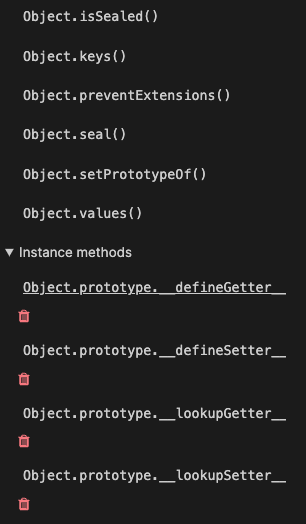

### 19.10 instanceof 연산자

---

```cs
우변의 생성자 함수의 prototype에 바인딩된 객체가
좌변의 객체의 프로토타입 체인 상에 존재하면 true, 아니면 false

객체 instanceof 생성자함수
```

```cs
// constructor 프로퍼티와 생성자 함수 간의 연결이 파괴되어도 instanceof는 아무런 영향을 받지 않는다.

//생성자 함수
function Person(name) {
  this.name = name;
}

const me = new Person('Lee');

// Person.prototype과 Object.prototype이 me 객체의 프로토타입 체인 상에 존재하므로 true로 평가
console.log(me instanceof Person); // true
console.log(me instanceof Object); // true
```

instanceof 연산자는 프로토타입의 constructor 프로퍼티가 가리키는 생성자 함수를 찾는 것이 아니라 생성자 함수의 prototype에 바인딩된 객체가 프로토타입 체인 상에 존재하는지 확인한다.

### 19.11 직접 상속

#### 19.11.1 Object.create에 의한 직접 상속

> `Object.create` 메서드는 명시적으로 프로토타입을 지정하여 새로운 객체를 생성한다.

```cs
/**
* 지정된 프로토타입 및 프로퍼티를 갖는 새로운 객체를 생성하여 반환한다.
* @param {Object} prototype - 생성할 객체의 프로토타입으로 지정할 객체
* @param {Object} [propertiesObject] - 생성할 객체의 프로퍼티를 갖는 객체
* returns {Object} 지정된 프로토타입 및 프로퍼티를 갖는 새로운 객체
*/
Object.create(prototype[, propertiesObject]);
```

- Object.create 메서드는 첫 번째 매개변수에 전달한 객체의 프로토타입 체인에 속하는 객체를 생성한다.
- 즉, **객체를 생성하면서 직접적으로 상속을 구현하는 것이다.**
  - new 연산자가 없이도 객체를 생성할 수 있다.
  - 프로토타입을 지정하면서 객체를 생성할 수 있다.
  - 객체 리터럴에 의해 생성된 객체도 상속받을 수 있다.

```cs
// 프로토타입이 null인 객체를 생성한다. 생성된 객체는 프로토타입 체인의 종점에 위치한다.
let obj = Object.create(null);
console.log(Object.getPrototypeOf(obj) === null); // true

obj = Object.create(Object.prototype); // obj = {}; 과 동일하다

obj = Object.create(Object.prototype, {
  x: { value: 1, writable: true, enumerable: true, configurable: true}
}); // obj = {x:1} 과 동일하다

console.log(obj.x); // 1
console.log(Object.getPrototypeOf(obj) === Object.prototype); // true

const myProto = { x : 10 };
obj = Object.create(myProto);

function Person(name) {
  this.name = name;
}
// obj -> Person.prototype -> Object.prototype -> null
obj = Object.create(Person.prototype);
console.log(Object.getPrototypeOf(obj) === Person.prototype); // true
```

Object.prototype의 빌트인 메서드인

- Object.prototype.hasOwnProperty, Object.prototype.isPrototypeOf, Object.Prototype.propertyIsEnumerable 등은
- 모든 객체의 프로토타입 체인의 종점, 즉 `Object.prototype`의 메서드이므로 모든 객체가 상속받아 호출할 수 있다.

하지만 ESLint에서는 `Object.prototype`의 빌트인 메서드를 객체가 직접 호출하는 것을 권장하지 않는다.
그 이유는 Object.create 메서드를 통해 프로토타입 체인의 종점에 위치하는 객체를 생성할 수 있기 때문이다.

- 프로토타입 체인의 종점에 위치하는 객체는 `Object.prototype`의 빌트인 메서드를 사용할 수 없다.

```cs
const obj = Object.create(null);
obj.a = 1;

console.log(obj.hasOwnProperty('a'));
// TypeError: obj.hasOwnProperty is not a function

이런 에러를 발생시킬 위험을 없애기 위해 Object.prototype의 빌트인 메서드는 간접적으로 호출하는 것이 좋다.
console.log(Object.prototype.hasOwnProperty.call(obj, 'a')); // true
```

#### 19.11.2 객체 리터럴 내부에서 `__proto__`에 의한 직접 상속

Object.create 메서드에 의한 직접 상속은 앞에서 다룬 것과 같이 여러 장점이 있다.
하지만 두번째 인자로 프로퍼티를 정의하는 것은 번거롭다.

- 객체 리터럴 내부에서 `__proto__` 접근자 프로퍼티를 사용하여 직접 상속을 구현할 수 있다.

```cs
const myProto = { x : 10 };

// 객체 리터럴에 의해 객체를 생성하면서 프로토타입을 지정하여 직접 상속받을 수 있다.
const obj = {
  y: 20,
  // 객체를 직접 상속받는다.
  // obj -> myProto -> Object.prototype -> null
  __proto__: myProto
};
/*
const obj = Object.create(myProto, {
  y: {value: 20, writable: true, enumerable: true, configurable: true}
})
*/

console.log(obj.x, obj.y); // 10 20
console.log(Object.getPrototypeOf(obj) === myProto); // true
```

### 19.12 정적 프로퍼티/메서드

---

> 정적(static) 프로퍼티/메서드는 **생성자 함수로 인스턴스를 생성하지 않아도** 참조/호출할 수 있는 프로퍼티/메서드를 말한다.

- Person 생성자 함수는 객체이므로 자신의 프로퍼티/메서드를 소유할 수 있다.
  - Person 생성자 함수 객체가 소유한 프로퍼티/메서드를 정적 프로퍼티/메서드라고 한다.
  - 정적 프로퍼티/메서드는 생성자 함수가 생성한 인스턴스로 참조/호출할 수 없다.

```cs
// 생성자 함수
function Person(name) {
  this.name = name;
}

// 정적 프로퍼티 / 메서드
Person.staticProp = 'static prop';
Person.staticMethod = function () {
  console.log('staticMethod');
};

const me = new Person('Lee');

// 생성자 함수에 추가한 정적 프로퍼티/메서드는 생성자 함수로 참조/호출한다.
Person.staticMethod(); // staticMethod

// 정적 프로퍼티/메서드는 생성자 함수가 생성한 인스턴스로 참조/호출할 수 없다.
// 인스턴스로 참조/호출할 수 있는 프로퍼티/메서드는 프로토타입 체인 상에 존재해야 한다.
me.staticMethod(); // TypeError: me.staticMethod is not a function
```


- 생성자 함수가 생성한 인스턴스는 자신의 프로토타입 체인에 속한 객체의 프로퍼티/메서드에 접근할 수 있다.
- 하지만 정적 프로퍼티/메서드는 인스턴스 프로토타입 체인에 속하지 않았으므로 인스턴스로 접근할 수 없다.

- `Object.create` 메서드는 Object 생성자 함수의 정적메서드고
  - 따라서 인스턴스로 호출할 수 없다.
- `Object.prototype.hasOwnProperty` 메서드는 `Object.prototype`의 메서드다.
  - 따라서 모든 객체가 호출할 수 있다.

```cs
// Object.create는 정적 메서드다.
const obj = Object.create({ name: 'Lee' });

// Object.prototype.hasOwnProperty는 프로토타입 메서드다.
obj.hasOwnProperty('name'); // -> false
```

- 프로토타입 메서드를 호출하려면 `인스턴스를 생성`해야 하지만
- 정적메서드는 **인스턴스를 생성하지 않아도 호출**할 수 있다.

```cs
function Foo() {}

// 프로토타입 메서드
// this를 참조하지 않는 프로토타입 메서드는 정적 메서드로 변경하여도 동일한 효과를 얻을 수 있다.
foo.prototype.x = function () {
  console.log('x');
};

const foo = new Foo();
// 프로토타입 메서드를 호출하려면 인스턴스를 생성해야 한다.
foo.x(); // x

// 정적 메서드
Foo.x = function () {
  console.log('x');
}

// 정적 메서드는 인스턴스를 생성하지 않아도 호출할 수 있다.
Foo.x(); // x
```

- 표기법 만으로도 정적프로퍼티/메서드와 프로토타입 프로퍼티/메서드를 구별할 수 있어야 한다.



### 19.13 프로퍼티 존재 확인

---

#### 19.13.1 in 연산자

객체 내에 특정 프로퍼티가 존재하는지 여부를 확인한다.

- 프로퍼티 뿐만 아니라 상속받은 모든 프로토타입의 프로퍼티를 확인하므로 주의해야 한다.
- ES6에서 도입된 `Reflect.has` 메서드를 사용할 수도 있다.

```cs
const person = {
  name: 'Lee',
  address: 'Seoul'
};

// person 객체에 name 프로퍼티가 존재한다.
console.log('name' in person); // true

// 💩 주의 -> Object.prototype의 메서드도 가져온다
console.log('toString' in person); // true

console.log(Reflect.has(person, 'name'));
```

#### 19.13.2 Object.prototype.hasOwnProperty 메서드

객체 고유의 프로퍼티 키인 경우에만 true를 반환하고,
상속 받은 프로토타입의 프로퍼티 키인 경우 false를 반환한다.

```cs
console.log(person.hasOwnProperty('name')); // true
console.log(person.hasOwnProperty('toString')); // true
```

### 19.14 프로퍼티 열거

---

#### 19.14.1 for...in 문

객체의 모든 프로퍼티를 순회하며 열거(enumeration) 할때 사용한다.

- 정확히는, 객체의 프로토타입 체인 상에 존재하는 모든 프로토타입의 프로퍼티 중에서
  - 프로퍼티 어트리뷰트 [[Enumerable]] -열거 가능 여부- 의 값이 true 인 프로퍼티를 순회하며 열거한다.
  - 프로퍼티 키가 심벌(Symbol) 인 프로퍼티는 열거하지 않는다.
  - for - in 문은 순서를 보장하지 않는다.

```cs
const person = {
  name: 'Lee',
  address: 'Seoul'
  // __proto__ 로 person 객체의 프로토타입에 프로퍼티로 age 프로퍼티를 추가했다. 이 또한 for - in문에 key로 할당
  __proto__: {
    age: "20",
  },
};

for(const key in person) {
  // 상속받은 프로퍼티는 제외하고, 객체 자신의 프로퍼티만 열거하려면
  // `Object.prototype.hasOwnProperty` 메서드를 사용하여 객체 자신의 프로퍼티인지 확인해야 한다
  if(!person.hasOwnProperty(key)) continue;
  console.log(key + ': ' + person[key]);
}
// name: Lee
// address: Seoul
// age: 20

console.log("toString" in person); // true
```

**배열에는 for..in 말고, for문이나 for..of 또는 Array.prototype.forEach 메서드를 사용하자**

- 배열도 객체이므로 상속받은 프로퍼티가 포함될 수 있다.

```cs
const arr = [1,2,3];
arr.x = 10; // 배열도 프로퍼티를 가질 수 있다.

for(const i in arr) {
  // 프로퍼티 x도 출력된다.
  console.log(arr[i]);
};

// arr.length는 3이다.
for(let i = 0; i < arr.length; i++) {
  console.log(arr[i]);
}

// forEach 메서드는 요소가 아닌 프로퍼티는 제외한다.
arr.forEach(v => console.log(v));

// for...of 는 변수 선언문에서 선언한 변수에 키가 아닌 값을 할당한다.
for(const value of arr) {
  console.log(value); // 1 2 3
}
```

#### 19.14.2 Object.keys/values/entries 메서드

- 객체 자신의 고유 프로퍼티만 열거하기 위해서는 `for-in` 보다 `Object.keys/values/entries` 메서드를 사용하는 것을 권장한다.

  - `for-in`은 상속받은 프로퍼티도 열거하기 때문

- `Object.keys` : 객체 자신의 열거가능한 (enumerable) 프로퍼티 키를 배열로 반환한다.

```cs
const person = {
  name: 'Lee',
  address: 'Seoul',
  __proto__: {age: 20}
};

console.log(Object.keys(person)); // {"name", "address"}
```

- `Object.values` : 객체 자신의 열거 가능한 프로퍼티 값을 배열로 반환

```cs
console.log(Object.values(person)); // ["Lee", "Seoul"]
```

```cs
console.log(Object.entries(person)); // [["name", "Lee"], ["address", "Seoul"]]

Object.entries(person).forEach(([key, value]) => console.log(key, value));
/*
name Lee
address Seoul
*/
```
