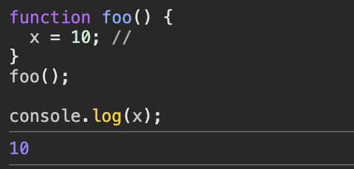

### 암묵적 전역(implicit global)

- 자바스크립트 엔진은 암묵적으로 전역 객체에 x 프로퍼티를 동적 생성한다.
- 개발자의 의도와는 상관없이 발생하므로 오류를 발생시키는 원인이 될 가능성이 크다.

  - 반드시 `var, let, const` 키워드를 사용하여 변수를 선언한 다음 사용해야 한다.

  

ES5부터 추가된 strict mode를 사용하면 자바스크립트 문법을 엄격히 적용할 수 있다.

- ESLint 사용을 더 권장한다!
  - 코딩 컨벤션 강제

### strict mode의 적용

전역의 선두 or 함수의 몸체의 선두에 `use strict`를 추가한다.

- 코드의 선두에 위치시키지 않으면 정상적으로 동작하지 않는다.

### 전역에 strict mode를 적용하는 것은 피하자

전역에 적용한 strict mode는 스크립트 단위로 적용된다.

- 여러 스크립트가 통합되어 사용되는 프로그램이 일반적이며, 그러한 프로그램 안에서 strict mode 는 각 스크립트 단위로 적용된다.
- 어떤 스크립트는 non-strict mode 인데, 이 둘을 혼용하는 것은 오류를 발생시킬 수 있다.
  - 특히, 외부 서드파티 라이브러리르 사용하는 경우가 non-strict mode 일 경우가 있다.
- 그래서, `strict mode` 를 사용시, `즉시 실행 함수` 로 스크립트를 감싸서 **스코프를 구분**해서, **다른 스크립트 파일에 영향이 받질 않도록 사용**하는 것이 바람직하다.

```cs
// 즉시 실행함수 내부에서 use strict 적용
(function () {
  "use strict";

  // code ...
})();

```

### 함수 단위로 strict mode를 적용하는 것도 피하자

strict mode는 즉시 실행함수로 감싼 스크립트 단위로 적용하는 것이 바람직 하다.

### strict mode가 발생시키는 에러

**암묵적 전역**

선언하지 않은 변수를 참조하면 ReferenceError가 발생한다

```cs
(function () {
  'use strict';

  x = 1;
  console.log(x); // ReferenceError: x is not defined
}());
```

**변수, 함수, 매개변수의 삭제**

delete 연산자로 변수, 함수, 매개변수를 삭제하면 SyntaxError가 발생한다.

**매개변수 이름의 중복**

중복된 매개변수 이름을 사용할 경우 SyntaxError가 발생한다.

**with 문의 사용**

with문은 전달된 객체를 스코프 체인을 추가하지만, 동일한 객체의 프로퍼티를 반복해서 사용할 때 객체 이름을 생략할 수 있어서 코드가 간단해지는 효과가 있지만 성능과 가독성이 나빠지는 문제가 있다.

### strict mode 적용에 의한 변화

#### 1. 일반함수의 this

strict mode 에서 함수를 일반 함수로서 호출하면 this에 undefined가 바인딩 된다.
생성자 함수가 아닌 일반 함수 내부에서는 this 를 사용할 필요가 없기 때문이다.

```cs
(function () {
  ("use strict");

  function foo() {
    console.log(this); // undefined
  }
  foo();

  function Foo() {
    console.log(this); // Foo
  }
  new Foo();
})();
```

#### 2. argument 객체

strict mode 에서는 매개변수에 전달된 인수를 재할당하여 변경해도 arguments 객체에 반영되지 않는다.

```cs
(function (a) {
  ("use strict");

  a = 2;

  console.log(arguments); // { 0: 1, length: 1 }
})(1);
```
