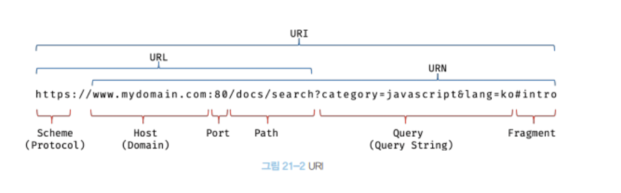

### 21.1 자바스크립트 객체의 분류

---

- `표준 빌트인 객체`: ECMAScript 사양에 정의된 객체를 의미, 애플리케이션 전역에 공통 기능을 제공, 전역 객체의 프로퍼티로 제공되므로 별도의 선언 없이 전역 변수처럼 언제나 참조가능

- `호스트 객체`: ECMAScript 사양에 정의되어 있지는 않지만, 브라우저 환경 or Node.js 환경에서 추가로 제공하는 객체를 의미

  - 브라우저: 클라이언트 사이드 Web API
  - Node.js: 고유의 API

- `사용자 정의 객체` : 사용자가 직접 정의한 객체를 의미

### 21.2 표준 빌트인 객체

---

- 자바스크립트는 Object, String, Number, Boolean, Symbol, Array, Map/Set, Function 등 40여 개의 표준 빌트인 객체를 제공

- 표준 빌트인 객체는 `모두 인스턴스를 생성`할 수 있는 생성자 함수 객체다 -> `프로토타입 메서드`와 `정적 메서드`를 제공

  - Math, Reflect, JSON 제외 -> `정적 메서드`만 제공

- 표준 빌트인 객체인 String을 생성자 함수로서 호출하여 생성한 String 인스턴스의 프로토타입은 String.prototype이다.

```cs
// String 생성자 함수에 의한 String 객체 생성
const strObj = new String('Lee'); //

// String 생성자 함수를 통해 생성한 strObj 객체의 프로토타입은 String.prototype이다.
console.log(Object.getPrototypeOf(strObj) === String.prototype); // true
```

- 표준 빌트인 객체의 prototype 프로퍼티에 바인딩된 객체는 다양한 기능의 `빌트인 프로토타입 메서드를 제공` 또한, 인스턴스 생성 없이도 호출 가능한 `빌트인 정적 메서드 제공`

```cs
// Number 생성자 함수에 의한 Number 객체 생성
const numObj = new Number(1.5);

// Number.prototype 에 프로토타입 메서드인 toFixed
console.log(numObj.toFixed()); // 2

// Number 빌트인 객체의 정적 메서드
console.log(Number.isInteger(0.5)); // false
```

### 21.3 원시값과 래퍼객체

---

> 문자열, 숫자, 불리언 같은 원시값 에 대해 객체처럼 접근하면 생성되는 임시 객체 를 래퍼 객체(wrapper object) 라고 한다.

```cs
const str = "Hello";

// 원시 타입인 문자열 -> 래퍼 객체인 String 인스턴스로 변환
console.log(str.length); // 5
console.log(str.toUpperCase()); // HELLO

// 래퍼 객체로 프로퍼티에 접근하거나 메서드를 호출한 후, 다시 원시값으로 되돌린다.
// 생성되었던 래퍼 객체는 "가비지 컬렉션"의 대상이 된다.
console.log(typeof str); // string 문자열 << 🔎 String 표준 빌트인 생성자 함수 타입이 아니다.

```

> 래퍼 객체가 생성되는 원시값들은 **암묵적으로 표준 빌트인 객체의 프로토타입에서 제공하는 메서드 or 프로퍼티를 참조할 수 있다.**
> 때문에, 굳이 new 연산자와 함께 인스턴스를 생성할 필요도 없고, 권장하지도 않는다.

### 21.4 전역 객체

---

> 자바스크립트 코드가 실행되기 이전(즉, 런타임 이전)에 **자바스크립트 엔진에 의해 어떤 객체보다도 먼저 생성되는 특수한 객체**를 전역 객체(global object) 라고 한다.

- 브라우저 환경: window, self, this, frames
- Node.js 환경: global

```cs
+ ES11 에서 도입된 globalThis 는 브라우저 환경과 Node.js 환경에서 여러 방식으로 전역 객체를 가리키던 것을 통일한 형태
+ globalThis 는 표준 사양이므로, ECMAScript 표준 사양을 준수하는 모든 환경에서 사용 가능
```

- 전역 객체는 표준 빌트인 객체(Object, String, Number, Function, Array 등)와 환경에 따른 호스트 객체, 그리고 var 키워드로 선언한 전역 변수와 전역 함수를 프로퍼티로 갖는다.
  - 전역 객체는 계층적 구조상 어떤 객체에도 속하지 않은 모든 빌트인 객체(표준 빌트인 객체와 호스트 객체)의 최상위 객체다.
  - 전역 객체가 최상위 객체라는 것은 프로토타입 상속 관계상에서 최상위 객체라는 의미가 아니라, 어떤 객체의 프로퍼티도 아니며 객체의 계층적 구조상 표준 빌트인 객체와 호스트 객체를 프로퍼티로 소유한다는 것

```cs
// var 키워드로 선언한 전역변수
var foo = 1;
console.log(window.foo); // 1

// 선언하지 않은 변수에 값을 암묵적 전역, bar는 전역 변수가 아니라 전역 객체의 프로퍼티다.
bar = 2; // window.bar = 2
console.log(window.bar); // 2

// 전역 함수
function bar() { return 3; }
console.log(window.bar()); // 3
```

- let, const 로 선언한 전역변수는 전역객체의 프로퍼티가 아니다.
  - 전역 렉시컬 환경의 선언적 환경 레코드 내에 존재하게 됨.

```cs
let foo = 123;
console.log(window.foo); // undefined
```

> 전역 객체는 몇 가지 프로퍼티와 메서드를 가지고 있다. 전역 변수와 전역 함수처럼 사용할 수 있는 것에 대해 알아보자.

#### 21.4.1 빌트인 전역 프로퍼티

전역 객체의 프로퍼티를 의미한다. 주로 애플리케이션 전역에서 사용하는 값을 제공한다.

- Infinity : 무한대를 나타내는 숫자값을 갖는다.
  - type = number
- NaN : Not-a-Number
  - type = number
- undefined
  - type = undefined

#### 21.4.2 빌트인 전역 함수

애플리케이션 전역에서 호출할 수 있는 빌트인 함수. 전역 객체의 메서드다.

**eval**

- 문자열 코드를 런타임에 실행하여 값을 생성한다.
- eval 함수를 통해 사용자로 부터 입력받은 콘텐츠를 실행하는 것은 보안상 매우 취약하며, 자바스크립트 엔진에 의해 최적화가 수행되지 않는 코드 특성 상, 처리 속도도 느리다. -> 사용하지 말아야 함.

**isFinite**

- 전달받은 인수가 정상적인 유한수인지 검사하여 boolean 으로 값을 리턴한다.
- 숫자로 타입 변환 후 검사를 수행한다 (null은 0으로 변환 후 검사)

**parseFloat**

- 전달받은 문자열 인수 를 실수(float)로 해석(parsing)하여 반환

**parseInt**

- 전달받은 문자열 인수 를 정수(integer)로 해석(parsing)하여 반환
- 인수가 문자열이 아니면, 문자열로 변환 후 정수로 해석하여 반환
- 두 번째 인수로 진법을 나타내는 기수(radix)를 전달할 수 있다.

```cs
// '10' -> 10진수로 해석(parsing) -> 10진수 정수로 반환(10)
console.log(parseInt("10")); // 10

// '10' -> 2진수로 해석(parsing) -> 10진수 정수로 반환(2)
console.log(parseInt("10", 2)); // 2

// '10' -> 8진수로 해석(parsing) -> 10진수 정수로 반환(8)
console.log(parseInt("10", 8)); // 8
```

- 기수를 지정하여 10진수 숫자 -> 해당 기수의 문자열로 반환 필요 시 -> `Number.prototype.toString(radix)` 메서드 적용

```cs
const x = 15;

console.log(x.toString(2)); // '1111'
console.log(parseInt(x.toString(2), 2)); // 15

console.log(x.toString(8)); // '17'
console.log(parseInt(x.toString(8), 8)); // 15

console.log(x.toString(16)); // 'f'
console.log(parseInt(x.toString(16), 16)); // 15

console.log(x.toString()); // '15'
console.log(parseInt(x.toString())); // 15
```

- 첫 번째 문자열 내에, 두 번째 인수로 전달한 radix 로 나타내는 숫자가 아닌 문자와 마주치면 전부 무시되고 해석된 정수값만 반환

```cs
// A은 10진법에서 벗어남 -> '10' 만 변환 -> 5
console.log(parseInt("1A0")); // 1

// 2은 2진법에서 벗어남 -> '10' 만 변환 -> 2
console.log(parseInt("102", 2)); // 2

// 8은 8진법에서 벗어남 -> '5' 만 변환 -> 5
console.log(parseInt("58", 8)); // 5

// G는 16진법에서 벗어남 -> 'F' 만 변환 -> 15
console.log(parseInt("FG", 16)); // 15
```

**encodeURI / decodeURI**



- `encodeURI` : 어떤 시스템에서도 읽을 수 있도록 url를 `아스키 문자셋`으로 변환하는 작업 (쿼리 스트링 구분자(=, ? , &)은 인코딩 하지 않음)
- `decodeURI` : 인코딩 된 URL를 원래 상태로 복구하는 것
- 완전한 `URL`를 문자열로 전달받아 `이스케이프 처리`를 위해 `인코딩`해주는 메소드

```cs
+ 인코딩 :  URI(Uniform Resource Identifier)의 문자들을 "이스케이프" 처리하는 것을 의미
+ 디코딩(decoding) : 인코딩된 URI를 이스케이프 이전 상태로 복원하는 것을 의미
```

- `이스케이프 처리` : 네트워크를 통해 정보를 공유할 때, 어떤 시스템에서도 읽을 수 있는 아스키 문자 셋으로 변환하는 것
  - URL은 아스키 문자 셋으로 구성되어야 하며 한글을 포함한 대부분의 외국어나 아스키 문자 셋에 정의되지 않은 특수 문자를 포함하지 않아야 한다.
  - 따라서, URL 내부에서 의미를 갖고 있는 문자`( %, ?, # )` 나 한글, 공백 등 또는 시스템에 의해 해석될 수 있는 문자`( <, > )` 를 이스케이프 처리하여 야기될 수 있는 문제를 예방해야 한다.
  - 단, 알파벳, 0~9의 숫자, `-, \_, ., !, ~, \*, ', (, )` 문자는 이스케이프 처리에서 제외

```cs
// 완전한 URI
const uri = "http://example.com?name=김지우&job=programmer&student";

// 원래 URI 형태 -> 이스케이프 처리된 URI 형태로
const enc = encodeURI(uri);
console.log(enc); // http://example.com?name=%EA%B9%80%EC%A7%80%EC%9A%B0&job=programmer&student

// 인코딩(이스케이프 처리)된 URI -> 원래 URI 형태로
const dec = decodeURI(enc);
console.log(dec); // http://example.com?name=김지우&job=programmer&student
```

**encodeURIComponent / decodeURIComponent 함수**

- `encodeURI / decodeURI` 와의 차이점은 URI 전체가 아닌, URI의 구성요소인 `쿼리 스트링`의 일부로 간주
- 따라서, 쿼리 스트링 구분자로 사용되는 ( `=, ? , &` ) 까지 인코딩한다
  - `encodeURI 함수` 는 매개변수로 전달된 문자열을 URI 전체 라고 간주하여 쿼리 스트링 구분자로 사용되는 ( =, ?, & ) 까지 인코딩하진 않는다.

```cs
[ encodeURI / decodeURI ]
쿼리 스트링 구분자(=, ?, &)는 인코딩 하지 않는다.

enc = encodeURI(uriComp);
console.log(enc); // name=%EC%9C%84%EC%98%81%EB%AF%BC&job=programmer&student

[ encodeURIComponent / decodeURIComponent ]
encodeURIComponent 는 쿼리 스트링 구분자(=, ?, &)까지 인코딩한다.

let enc = encodeURIComponent(uriComp);
console.log(enc); // name%3D%EC%9C%84%EC%98%81%EB%AF%BC%26job%3Dprogrammer%26student

```
