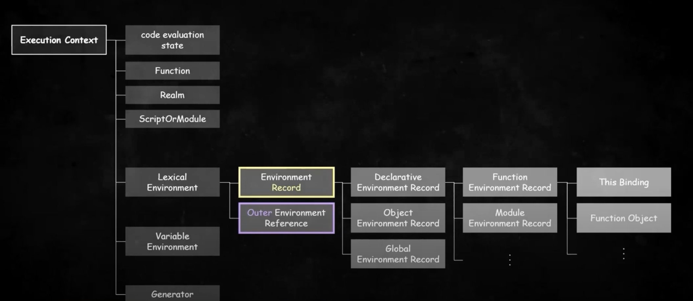
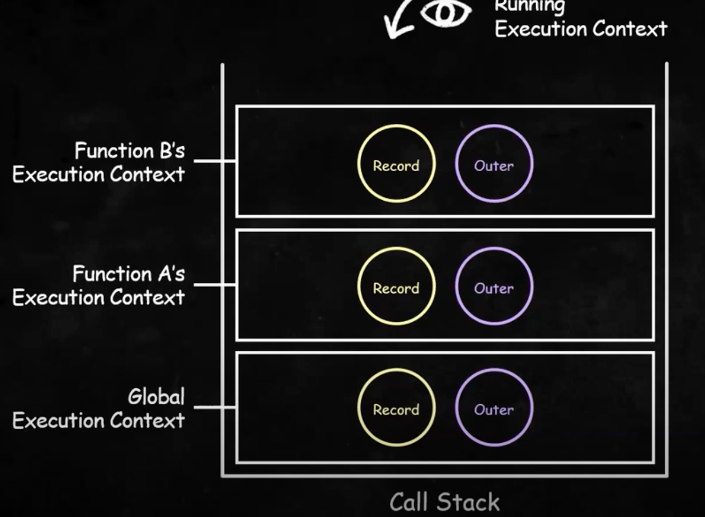
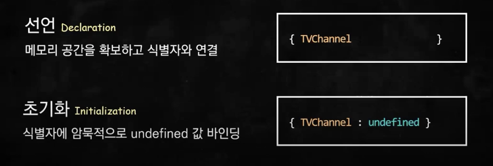
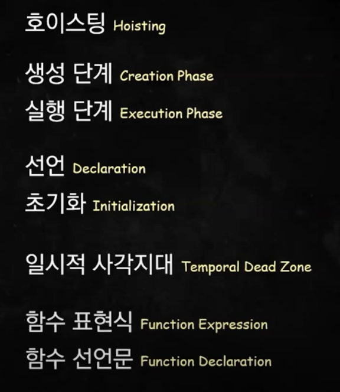
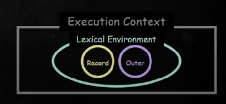
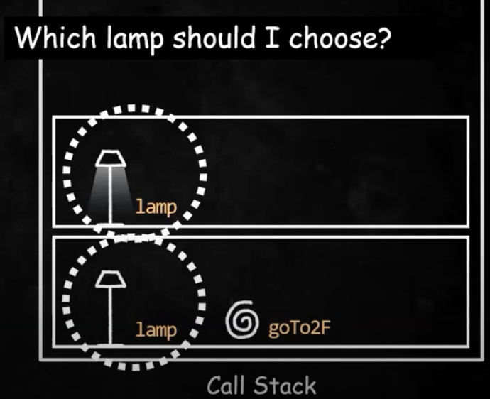
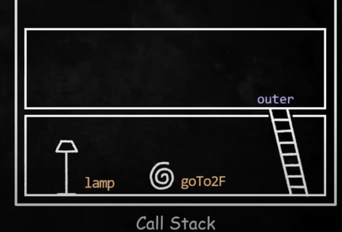
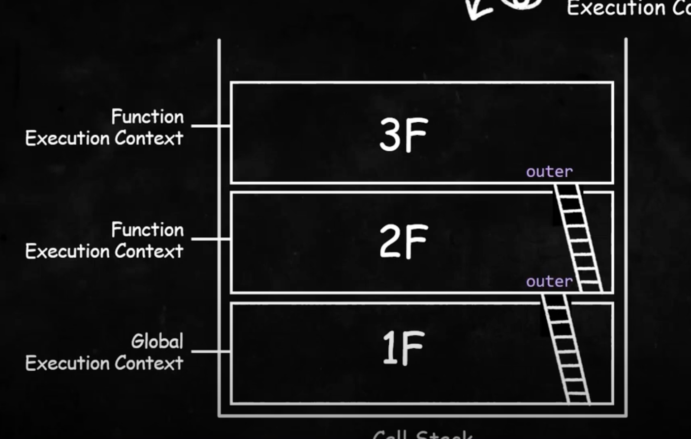

> 🔥 실행컨텍스트: 자바스크립트의 동작원리를 담고 있는 핵심 개념

실행컨텍스트를 이해하면, 자바스크립트가 스코프를 기반으로 **식별자와 식별자에 바인딩된 값(식별자 바인딩)을 관리하는 방식**과
`호이스팅`이 발생하는 이유, `클로저`의 동작 방식, 그리고 `태스크 큐`와 함께 동작하는 `이벤트 핸들러`와 `비동기 처리의 동작 방식`을 이해할 수 있다.




### 언제 실행컨텍스트를 생성했다가 언제 없애는가?

- 자바스크립트 **코드를 실행시키면** 자바스크립트 엔진은 `Call Stack`이라는 통에 `전역 실행컨텍스트`를 담는다.

- 실행컨텍스트니까 안에 아까봤던 `Record`와 `Outer`가 담겨있고
  `함수 A의 실행 컨텍스트`를 생성해서 또 `Call Stack`에 담는다.

- 콜스택에서는 가장 최근에 추가된 실행 컨텍스트만 활성화된다.
  만약 함수A에서 함수B가 호출되면 또 실행컨텍스트를 담는다.



함수B의 실행을 마치고 함수 B가 **종료되면 실행컨텍스트가 사라진다**.
이어서 함수A가 사라지면 실행컨텍스트도 사라진다.

### 1. `Record`로 `호이스팅` 이해하기

---

```cs
// var로 선언한 경우
console.log(TVChannel); // undefined
var TVChannel = "NetFlix";
console.log(TVChannel); // netflix
```

> `호이스팅`: 선언문이 마치 최상단에 끌어올려진 듯한 현상

**호이스팅이 발생하는 이유?**

- 선언문이 있는 코드라인을 물리적으로 최상단에 끌어올렸기 때문이 아니라,
  자바스크립트 엔진이 먼저 코드를 스캔하면서 **변수같은 정보를 실행컨텍스트 어딘가에
  미리 기록해놓기 때문**이다.

- 이때 기록해 놓는 곳이 `Environment Record`이고, `식별자와 식별자에 바인딩된 값을 기록`해두는 객체다.

- 이 환경레코드에 **변수가 어떻게 저장되는지만 봐도** 호이스팅을 빠삭하게 이해할 수 있다.

### 1-1. Variable Hoisting (var, let, const)

---

1. `Create & Push`

   전역 실행 컨텍스트 한칸을 생성해서 콜스택에 넣는다.

2. `Scan & Declare` 생성단계 (선언문만 실행해서 환경레코드에 기록)

   전체 코드를 스캔하면서 선언할게 있는지 찾아보고 있다면 먼저 선언해둔다.
   선언하는 과정에는 생성해둔 실행컨텍스트 안에 있는 환경레코드에 새로운 식별자 TV Channel을 기록한다.

```cs
// var로 선언한 경우
 { TVChannel: undefined } // 선언
```

3. `실행단계` : 생성단계에서 환경레코드에 **기록해둔 정보를 참조하거나 업데이트**

   선언문 외 나머지 코드 순차적 실행

```cs
{ TVChanel: "Netflix" } // 업데이트해서 할당 (환경레코드에 저장)
console.log(); 에서는 환경레코드의 값을 참조
```

```cs
// let, const로 선언한 경우
console.log(TVChannel); // ReferenceError -> 일시적 사각지대
// let, const로 선언했을때 선언 이전에 식별자를 참조할 수 없는 구역
const TVChannel = "NetFlix";
console.log(TVChannel); // netflix
```

- **let, const로 선언한 경우**
  엔진이 TV Channel **식별자를 기록해두긴 하지만 값을 초기화하지는 않는다.**

```cs
{ TVChannel }
// 따라서 선언문 이전에 TV Channel을 참조하려고 하면 ReferenceError 발생
```

> **let, const가 선언만 하는 이유**: 선언라인 이전에는 참조할 수 없도록.
> 일반적인 프로그래밍 방식을 추구할 수 있도록 '언어차원에서 보완되었다'



### 1-2. Function Hoisting

1. `함수표현식`: **변수 호이스팅과 동일하게 동작**

```cs
study(); // TypeError = undefined는 function이 아님
var study = () => {

}
// call stack
{ study : undefined } 로 저장
```

```cs
study(); // Reference Error:
const study => () => {

}
// call stack
{ study } // 환경레코드에 기록된 값이 없음
```

2. `함수 선언문`: 선언과 동시에 **완성된 함수 객체를 생성**해서 **환경 레코드에 기록함**.
   선언라인 전에도 함수를 호출할 수 있다!

```cs
study(); // 에러없이 실행된다.

function study() {
  console.log('study');
}

// call stack
{ study: f {} }
```



### 2. `Outer`: 외부환경참조 - 바깥 Lexical Environment를 가리킴

> `Lexical 환경(정적환경)`: Record, Outer를 합친 환경



```cs
let lamp = false;

function goTo2F() {
  let lamp = true;
  console.log(lamp); // ?
}
goTo2F();
```



- 이런 상황에서 **함수나 변수의 값을 결정**해내는 것을 `식별자 결정`이라 한다.
- 자바스크립트 엔진이 어떻게 `outer를 활용`해서 의사결정을 하는지 알아보자



1. `goTo2F();` 가 실행된다고 생각해보자.
   함수의 실행컨텍스트를 새로 생성하고
   이때 자바스크립트 엔진은 새로 생성된 실행컨텍스트에
   바깥 `렉시컬환경`으로 돌아갈 수 있는 outer를 남겨놓는다.

- 이제 필요한 경우 바깥 환경레코드에 저장된 식별자도 참조할 수 있게 되었다.

```cs
let lamp = false;

function goTo2F() {
  let lamp = true;
  console.log(lamp); // ?
  function goTo3F() {
    let pet = 'puppy';
    console.log(pet); // puppy
    console.log(corona); // ReferenceError
    console,log(lamp); // true
    // 2층의 lamp가 있기 때문에 1층의 lamp는 가려진다.
    // ✅ 변수 섀도잉
  }
  goTo3F();
}
goTo2F();
```

✅ `변수 섀도잉`: **동일한 식별자**로 인해 상위 스코프에서 선언된 식별자의 값이 가려지는 현상

✅ `스코프체인`: 식별자를 결정할 때 활용하는 **스코프의 연결 리스트**

✅ `스코프체이닝`: 식별자를 결정하기 위해 **타고타고 가서 결정하는 것** 자체



### 3. 실행컨텍스트 정리

---

#### 식별자 결정을 더욱 효율적으로 하기 위한 수단으로써, 필요한 정보를 한데 모아 제공하는 객체

- ES3 에서는 함수가 **어디에서 호출되느냐**에 따라 스코프가 달라졌다.
- 함수가 호출될 때마다 동적으로 **그에 걸맞는 스코프를 생성하고 스코프 체인을 연결해 주어야 했다.**

- ES5에 들어서는 식별자 결정을 위한 매커니즘이 변경되었다.
- **실행컨텍스트라는 하나의 덩어리, 하나의 묶음으로 관리**하도록
- 스코프가 호출되는 위치와 상관없이 **어디에 선언되어있느냐에 따라 정적으로 결정**되고
- 하나의 컨텍스트 개념으로 묶어놨기 때문에 자바스크립트 엔진은 더욱 **빠르고 효율적으로 식별자를 결정**할 수 있게 되었다.
