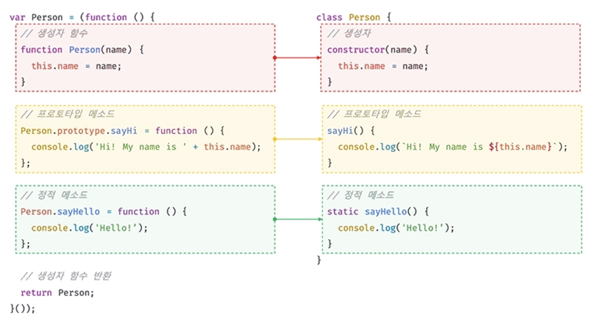

- 생성자함수와 클래스는 프로토타입 기반의 객체지향을 구현했다는 점에서 매우 유사하다.
- 클래스는 생성자 함수 기반의 객체 생성 방식보다 견고하고 명료하다
  - extends, super

클래스 몸체에서 정의할 수 있는 메서드: constructor, 프로토타입 메서드, 정적메서드

### 클래스 호이스팅

- var, let, const, function, function\*, class 키워드를 사용하여 선언된 모든 식별자는 호이스팅된다. 모든 선언문은 `런타임` 이전에 먼저 실행되기 때문이다.

### 인스턴스 생성
