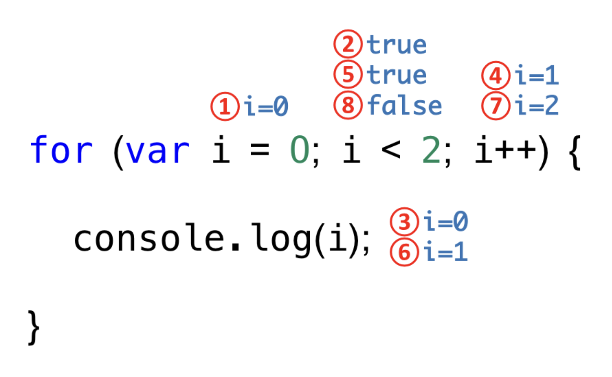

### 제어문 개요

---

> 제어문은 조건에 따라 코드 블록을 실행(조건문)하거나 반복실행(반복문)할 때 사용한다.

- 제어문은 코드의 실행 흐름을 인위적으로 제어할 수 있다. → 순자적으로 진행하는 직관적인 코드의 흐름을 혼란스럽게 만든다.
- 즉, 제어문은 코드의 흐름을 이해하기 어렵게 만들어 가독성을 해치는 단점 이 있다. → 가독성이 좋지 않은 코드는 오류를 발생시키는 원인

```c
+ forEach()
+ map()
+ filter()
+ reduce()

같은 "고차 함수"를 사용한 "함수형 프로그래밍 기법"에서는 제어문의 사용을 억제하여 복잡성을 해결하려고 노력한다.

```

### 8.1 블록문

---

블록문은 0개 이상의 문을 중괄호로 묶은 것.

**특징**

- 언제나 문(statement)의 종료를 의미하는 자체 종결성을 갖기 때문에 세미콜론을 붙이지 않는다.

```cs
{
  var foo = 10;
}
```

### 8.2 조건문

---

- `if..else` 와 `switch`문으로 제공한다.

### 8.2.1 if...else

- if문의 조건식은 boolean 값으로 평가되어야 한다.
- 코드 블록 내에의 문이 하나뿐이라면 중괄호를 생략할 수 있다.
- 삼항 조건 연산자로 바꿔 쓸 수 있고, 삼항 연산자는 값으로 평가되는 표현식이다. 따라서 변수로 할당할 수 있다.

```cs
if(조건식) {

}

if(num > 0) kind = "양수";

// 조건에 따라 단순히 값을 결정하여 변수에 할당하는 경우 삼항 조건 연산자를 사용하는 편이 가독성이 좋다.
var kind = num ? (num > 0 ? '양수' : '음수') : '명';
```

### 8.2.2 switch

- switch문은 주어진 표현식을 평가하여 그 값과 일치하는 표현식을 갖는 case문으로 실행 흐름을 옮긴다.

- `if...else` 조건식: boolean값으로 평가
- `switch` 표현식: 문자열이나 숫자값인 경우가 많음

**💡폴스루(fall through)**

> 문을 실행한 후 switch문을 탈출하지 않고 모든 case와 default문을 실행하는 것

- 기본적으로 case문에는 break문을 추가해야 한다.

**break 문을 생략한 폴스루가 유용한 경우**

- 여러개의 case문을 하나의 조건으로 사용하기

```cs
// 윤년 계산
swtich (month) {
	case 1: case 3: case 5: case 7: case 8: case 10: case 12:
		days = 31;
		break;
	case 4: case 6: case 9: case 11:
		days = 30;
		break;
	case 2:
		days = ((year % 4 === 0 || year % 100 !== 0) || (year % 400 === 0)) ? 29 : 28;
		break;
	default:
		console.log("Invaild month");
}
```

- case, default, break등 다양한 키워드를 사용해야 하고, 폴스루가 발생하는 등 문법도 목잡하다.
- 따라서 `if..else`문으로 해결할 수 있다면 `switch`문 보다 `if..else`문을 사용하는 편이 좋다.
- 조건식이 너무 많아서 가독성이 떨어지는 경우 `switch`를 사용한다.

### 8.3 반복문 (loop statement)

---

- 자바스크립트는 `for`, `while`, `do..while`문을 제공한다.

**💡반복문을 대체할 수 있는 다양한 기능**

- `forEach`: 배열을 순회할 때 사용
- `for..in`: 객체의 프로퍼티를 열거할 때 사용
- `for..of`: ES6에서 도입된 이터러블을 순회할 수 있음

### 8.3.1 for 문

for문은 조건식이 거짓으로 평가될 때까지 코드 블록을 반복 실행한다.

```c
for(변수 선언문 또는 할당문; 조건식; 증감식) {
  조건식이 참인 경우 반복 실행될 문;
}
```



```cs
1️⃣ for문을 실행하면 먼저 변수선언문 var i = 0이 실행된다.
변수 선언문은 단 한 번만 실행된다.

2️⃣ 변수 선언문의 실행이 종료되면 조건식이 실행된다.
현재 i 변수의 값은 0이므로 조건식의 평가 결과는 true다.

3️⃣ 조건식의 평가 결과가 true이므로 코드 블록이 실행된다.
증감문으로 실행 흐름이 이동하는 것이 아니라 코드 블록으로 실행 흐름이 이동하는 것에 주의하자.

4️⃣ 코드 블록의 실행이 종료되면 증감식 i++가 실행되어 i 변수의 값은 1이 된다.

5️⃣ 증감식 실행이 종료되면 다시 조건식이 실행된다.
변수 선언문이 실행되는 것이 아니라 조건식이 실행된다는 점에 주의하자
(앞에서 설명했지만 변수 선언문은 단 한 번만 실행된다.)
현재 i 변수의 값은 1이므로 조건식의 평가 결과는 true다.
```

- for문의 변수 선언문, 조건식, 증감식은 모두 옵션이므로 반드시 사용할 필요는 없다.
- 단, 어떤 식도 선언하지 않으면 무한루프가 된다.

```c
for (;;) { ... } //무한루프
```

### 8.3.2 while 문

- 주어진 조건식의 평가 결과가 참이면 코드 블록을 계속해서 반복 실행한다.
- while문은 조건문의 평가 결과가 거짓이 되면 코드 블록을 실행하지 않고 종료한다.
- 무한 루프에서 탈출하기 위해서는 코드 블록 내에 `if`문으로 탈출 조건을 만들고 `break`문으로 탈출한다.

```c
while(true) {
  count++;
  if(count === 3) break;
}
```

### 8.3.3 do...while 문

코드 블록을 먼저 실행하고 조건식을 평가한다.

```cs
// count가 3보다 작을 때까지 코드 블록을 반복 실행한다.

var count = 0;

do {
  console.log(count); // 0 1 2
  count ++;
} while (count < 3);
```

### 8.4 break문

---

- 레이블 문, 반복문, 또는 switch 문의 코드블록을 탈출한다. 이 외의 블록에 break문을 사용하면 SyntaxError가 발생한다.

**❓레이블문**

- 식별자가 붙은 문

```cs
// foo라는 레이블 식별자가 붙은 레이블 문
foo: console.log('foo');
```

- 프로그램의 실행 순서를 제어하는 데 사용한다.
- switch문의 `case`문과 `default`문도 레이블 문이다.
- 레이블 문을 탈출하려면 break문에 레이블 식별자를 지정한다.

```cs
foo: {
  break foo;
}
```

- 내부 for문에서 break문을 실행하면 탈출하여 외부 for문으로 진입한다.
- 내부 for문이 아닌 `외부 for문을 탈출하려면` 레이블 문을 사용한다

```cs
outer: for() {
  for() {
    if(i + j === 3) break outer;
  }
}
```

- 레이블 문은 중첩된 for 문 외부로 탈출 할 때 유용하지만 그 외에는 일반적으로 권장하지 않는다.
- 레이블 문 사용시 → 프로그램의 흐름이 복잡해져서 가독성이 나빠지고 오류를 발생시킬 가능성이 높아지기 때문 ( 존재 정도만 인지할 것 )

### 8.5 Continue 문

---

> continue 문 은 반복문의 코드 블록 실행을 현 시점에서 중단하고 ,
> 반복문의 증감식으로 실행 흐름을 이동시킨다. ( break 문처럼 반복문을 탈출하지는 않는다. )

```cs
// for (var i = 0; i < string.length; i++) {
  // search값이 아니면 현 지점에서 실행을 중단하고 반복문의 증감식으로 이동한다.
  if(string[i] !== search) continue;
  count++; // continue문이 실행되면 이 문은 실행되지 않는다.
}
```

- if 문 내에서 `실행해야 할 코드가 길다면` → `들여쓰기가 한 단계 더 깊어지므로` , continue 문을 사용하는 편이 가독성이 더 좋을 수 있다.

```cs
// if문 내에서 여러 코드 작성해야 할 경우 -> continue 문을 사용하지 않았을 경우
var arr = [1, 2, 3, 4, 5];
var target = 3;
var count = 0;

for (var i = 0; i < arr.length; i++) {
  // arr[i] 가 target 이하라면 count 증감
  if (arr[i] <= target) {
    count++;
    // code...
    // code...
    // code...
  }
}

// if문 내에서 여러 코드 작성해야 할 경우 -> continue 문을 사용한 경우 -> depth가 하나 줄어들었다.
var arr = [1, 2, 3, 4, 5];
var target = 3;
var count = 0;

for (var i = 0; i < arr.length; i++) {
  // arr[i] 가 target 초과이면 count 증감하지 않는다.
  if (arr[i] > target) continue;

  count++;
  // code...
  // code...
  // code...
}
```
