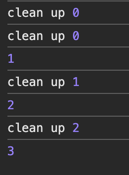

### 1. useState

- 렌더링은 함수 컴포넌트의 return을 실행한다음, 이 실행 결과를 이전의 리액트 트리와 비교해 리렌더링이 필요한 부분만 업데이트 한다.

- 매번 렌더링이 발생될 때 마다 함수는 다시 새롭게 실행되고, 새롭게 실행되는 함수에서 state는 매번 hello로 초기화되므로 아무리 state를 변경해도 다시 초기화 된다.

- 함수 컴포넌트는 매번 함수를 실행해 렌더링이 일어나고, 함수 내부의 값은 함수가 실행될 때마다 다시 초기화 된다.

useState 훅의 결과값은 어떻게 함수가 실행돼도 그 값을 유지하고 있을까?

> 클로저 이용: 어떤 함수 (useState) 내부에 선언된 함수 (setState)가 함수의 실행이 종료된 이후에도 지역변수인 state를 계속 참조할 수 있다.

#### Lazy initialization

- useState에 변수 대신 함수를 넘기는 것
- state가 처음 만들어질 때만 사용되고, 이후에 리렌더링이 발생된다면 함수의 실행은 무시된다.

```cs
const [state, setState] = useState(() => {
  console.log('...') // App 컴포넌트가 처음 구동될 때만 실행되고, 이후 렌더링 시에는 실행되지 않는다.
  return 0
})
```

- localStorage, sessionStorage에 대한 접근, map, filter, find 같은 배열에 대한 접근, 혹은 초깃값 계산을 위해
  함수 호출이 필요할 때와 같이 무거운 연산을 포함해 실행비용이 많이 드는 경우 사용

### 2. useEffect

> **컴포넌트가 렌더링 된 후에 어떠한 부수효과를 일으키고 싶을 때 사용하는 훅**

- '언제' 일어나는지보다 '어떤 상태값'과 함께 실행되는지 살펴보는 것이 중요함

```cs
useEffect(() => {

}, [props, state])
//  첫번째 인수 = 실행할 부수 효과가 포함된 함수
// 두번째 인수 = 의존성 배열
```

#### 어떻게 의존성 배열이 변경된 것을 알고 실행될까?

- 함수 컴포넌트는 매번 함수를 실행해 렌더링을 수행한다.
- 함수 컴포넌트는 렌더싱 시 마다 고유의 state와 props를 갖고 있다.
- state와 props의 변화 속에서 일어나는 렌더링 과정에서 실행되는 부수효과 함수

#### 클린업 함수

- 이벤트를 등록하고 지울 때 사용한다.
- 특정 이벤트 핸들러가 무한히 추가되는 것을 방지한다.
- unmount 개념이라기 보다는, 함수 컴포넌트가 리렌더링 됐을 때 의존성 변화가 있었을 당시 이전의 값을 기준으로 실행되는 개념
- **콜백에 실행될 때 마다, 이전의 클린업 함수가 존재한다면 그걸 먼저 실행한 뒤 콜백을 실행한다**
- 따라서 이벤트를 삭제하는 코드를 클린업 함수에 추가하는 것.

```cs
const [counter, setCounter] = useState(0);

  function handleClick() {
    setCounter(prev => prev + 1);
  }

  useEffect(() => {
    function addMouseEvent() {
      console.log(counter);
    }

    window.addEventListener('click', addMouseEvent);

    // 클린업 함수
    return () => {
      console.log('clean up', counter); // 이전 counter 값을 참조함
      window.removeEventListener('click', addMouseEvent);
    }
  }, [counter]);

  return (
    <>
      <h1>{counter}</h1>
      <button onClick={handleClick}>+</button>
    </>
  )
```



#### 의존성 배열

- 빈 배열인 경우
  - 최초 렌더링 직후에 실행된 다음부터는 더 이상 실행되지 않는다.
  - 아무 값도 넘겨주지 않으면 이 때는 의존성 비교할 필요 없이 렌더링이 발생할 때마다 실행됨

#### useEffect 유무의 차이

```cs
function Component() {
  console.log('렌더링 됨')
}

function Component() {
  useEffect(() => {
    console.log('렌더링됨')
  })
}
```

- useEffect는 `클라이언트 사이드`에서 실행되는 것을 보장함
  - 따라서 내부에서 **window 객체 접근하는 코드**를 사용해도 됨
- useEffect는 **컴포넌트 렌더링이 완료된 이후**에 실행됨 -> 성능에 영향 X
  - 1번의 경우 컴포넌트 렌더링 도중 실행됨
  - 서버사이드 렌더링의 경우 서버에서도 실행됨
  - 이 작업은 함수 컴포넌트의 반환을 지연시키는 행위임
  - 즉 무거운 작업인 경우 렌더링을 방해하므로 성능에 악영향

#### 주의할 점

**1. react-hooks/exhaustive-deps ESLint 룰을 무시하지 말 것**

```cs
function Component({log}) {
 useEffect(() => {
    logging(log);
  // eslint-disable-next-line react-hooks/exhaustive-deps
  }, []);
};
```

- 주로 컴포넌트를 마운트하는 시점에만 뭔가 하고 싶을 때 사용
- log가 최초로 props로 넘어와서 컴포넌트가 최초로 렌더링 된 시점에만 실행된다.
  - log가 아무리 변해도 부수효과 실행 안될 수 있음
  - 따라서 logging은 부모컴포넌트에서 실행되는 것이 옳을 것.
- 변경시점을 피할 목적이라면 메모이제이션을 적절히 활용하거나, 적당한 실행위치를 고려해야함

**2. useEffect의 첫번째 인수에 함수명을 부여하라**

- 목적을 명확히 하게 된다.

```cs
useEffect(
  function logActiveUser() {
    logging(user.id)
  }, [user.id]
)
```

**3. 거대한 useEffect를 만들지 마라**

- useEffect는 의존성 배열을 바탕으로 렌더링 시 의존성이 변경될 때마다 부수 효과를 실행.
- 이 부수 효과의 크기가 커질수록 애플리케이션 성능에 악영향
- 적은 수의 의존성 배열을 사용하도록 변경

**4. 불필요한 외부 함수를 만들지 마라**

- useEffect 내에서 사용할 부수효과라면 내부에서 만들어서 정의해서 사용하는 편이 훨씬 도움이 된다.

**5. useEffect의 콜백 인수로 비동기 함수를 바로 넣지 않는다.**

- 비동기로 함수를 호출할 경우 state의 경쟁상태를 야기할 수 있다.
- cleanup 함수의 실행순서도 보장할 수 없다.
- 다만 async await 함수를 선언해 실행하거나, 함수를 만들어서 사용하는 것은 가능하다.

```cs
// Effect callbacks are synchronous to prevent race conditions. Put the async function inside:
  useEffect(async() => {
    const response = await fetch('https://jsonplaceholder.typicode.com/todos/1');
    const data = await response.json();
    console.log(data);
  }, [])
```

```cs
  useEffect(() => {
    async function fetchData() {
      const response = await fetch('https://jsonplaceholder.typicode.com/todos/1');
      const json = await response.json();
      console.log(json);
    }
  }, [])
```
